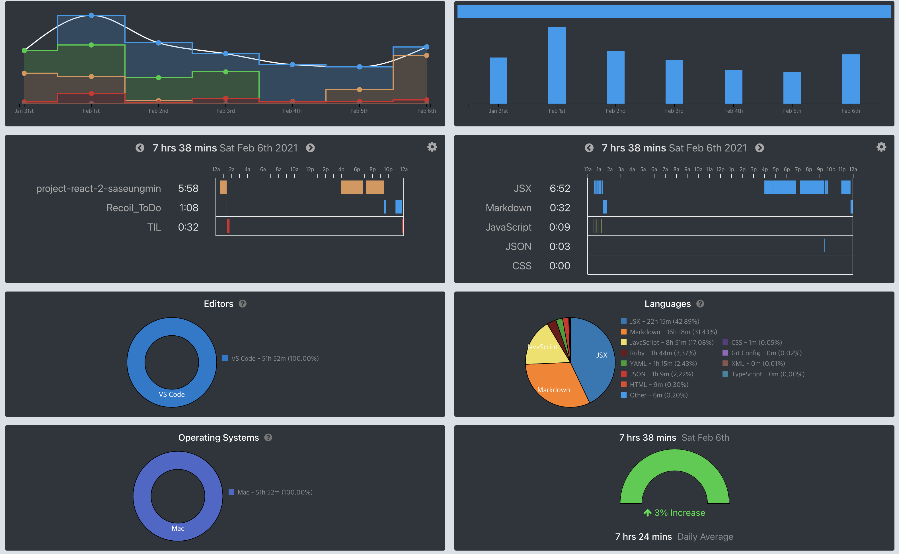

## 📆 2021-02-09(화) TIL

### 📈 어제의 계획이 예상대로 진행됐나요?
- [x] 앨레강트 오브젝트 2장 마무리. 읽고 정리하기
  - 2장을 마무리지었다.
  - [PR Link](https://github.com/saseungmin/reading_books_record_repository/pull/35)
- [ ] 알고리즘 공부하기
- [x] Recoil를 사용한 ToDo 앱 만들기 진행하기 (CSS 작업)
  - 오늘은 CSS 작업을 진행하였다. 전체적인 틀을 잡고 input 창에 대한 CSS를 진행하였다.
  - [PR Link](https://github.com/saseungmin/Recoil_ToDo/pull/18)


### 🦄 이번주 목표 진행사항은요? (오늘 조금이라도 진행했으면 체크)
- [ ] 알고리즘 공부 시작하기
- [x] 리플레쉬 및 정리
- [x] 긍정적이게 생각하기 😤
- 설날


### 🤔 공부하면서 배운것이 있다면?

#### 🎈 앨레강트 오브젝트 Chapter 2
- 상태 변경이 불가능한 불변 클래스로 구현하면 우지보수성을 크게 향상시킬 수 있다.
- 인스턴스를 생성한 후에 상태를 변경할 수 없는 객체를 불변 객체라고 부른다.

```java
class Cash {
  private final int dollars;

  public Cash mul(int factor) {
    return new Cash(this.dollars * factor);
  }
}
```
- 불변 객체는 자기 자신을 수정할 수 없고 항상 원하는 상태를 가지는 새로운 객체를 생성해서 반환해야 한다.

```java
Cash five = new Cash(5);
Cash fifty = five.mul(10);
System.out.println(fifty); // 50
```
- 식별자 가변성은 동일해 보이는 두 객체를 비교한 후 한 객체의 상태를 변경할 때 문제가 발생하는데 불변 객체는 식별자 가변성에 대한 문제가 없다.
- 실패 원자성은 완전하고 견고한 상태의 객체를 가지거나 아니면 실패하거나 둘 중 하나만 가능한 특성이다. 모든 불변 객체는 원자적이기 때문에 원자성을 걱정할 필요가 없다.
- 시간적 결합은 특정한 순서로 서로 결합되어 있는 것으로 프로그래머가 이 순서를 기억해야 한다. 때문에 유지보수에 있어서 어려움이 크다. 불변 객체를 사용해서 해결할 수 있다. (하나의 문장으로 객체를 인스턴스화 한다.)
- 불변 객체를 사용하면 부수효과를 제거할 수 있는데 불변으로 만들어진 클래스는 누구도 객체를 수정할 수 없기때문에 상태가 변하지 않았다고 확신할 수 있다.
- 모든 객체를 불변으로 만들면 객체 안에 `NULL`을 포함시키는 것이 애초에 불가능해져 작고, 견고하며, 응집도 높은 객체를 생성할 수 밖에 없도록 강제된다.
- 스레드 안정성이란 여러 스레드에서 동시에 사용될 수 있으며 그 결과를 항상 예측가능하도록 유지할 수 있는 객체의 품질을 의미한다. 불변 객체는 실행 시점에 상태를 수정할 수 없게 금지함으로써 결과를 항상 예측가능하도록 유지할 수 있다.
- 단위 테스트를 작성할수록 더 적은 문서화가 요구된다. 단위 테스트가 바로 문서화이다.
- 모의 객체 대신 페이크 객체를 사용해야 한다. 페이크 클래스를 사용하면 테스트를 더 짧게 만들 수 있기 때문에 유지보수성이 눈에 띄게 향상된다.
- 모킹의 경우, 테스트가 장황해지고, 이해하거나 리팩토링하기 어려워진다. 또한, 모킹은 가정을 사실로 전환시키기 때문에 단위 테스트를 유지보수하기 어렵게 만든다.
- 인터페이스를 짧게 유지하고 스마트(smart)를 사용한다.

```java
interface Exchange {
  float rate(String source, String target);

  final class Smart {
    private final Exchange origin;

    public float toUsd(String source) {
      return this.origin.rate(source, "USD");
    }

    public float eurToUsd() {
      return this.toUsd("EUR");
    }
  }
}
```
- 스마트 클래스의 크기는 점점 더 커지겠지만, `Exchange` 인터페이스는 작고, 높은 응집도를 유지할 수 있다. 인터페이스를 짧게 만들고 스마트 클래스를 인터페이스와 함께 배포함으로써 공통 기능을 추출하고 코드 중복을 피할 수 있다.

#### 🎈 Recoil을 사용한 ToDo 앱 만들기
- 오늘은 CSS 작업을 진행하였다.
- `transition`의 `cubic-bezier`를 배웠다.
- `cubic-bezier`에 대한 좋은 사이트를 찾았다. ([Link](https://cubic-bezier.com/))

```css
transition-timing-function: ease-in-out;
transition: all 0.2s cubic-bezier(.65,.33,.65,.33);
```

- `animation`의 속성하나도 알았다.
- 아래와 같이 `shake keyframes`를 주면 좌우로 흔들린다. 0.1초(`.1s`)동안 일정한 속도(`linear`)로 3번(`animation-iteration-count: 3`) 흔들린다.

```css
@keyframes shake {
    0% { left: -5px; }
    100% { right: -5px; }
};

position: relative;
animation: shake .1s linear;
animation-iteration-count: 3;
```


### ⚡ 아쉬운 점 및 회고
- 오늘은 그래도 오전에 일어났다. 10시 기상. 차근 차근 일찍 일어나야겠다.
- 오늘은 약속이 있어서 생각보다 얼마 진행하지 못했다.
- 저번주는 VSCode 사용만 52시간이였다. 정보를 찾고 Github를 사용하는 시간까지 포함하면 한 62시간 정도 되지 않았을까? 흠.. 하루에 평균적으로 9시간 정도 했다는건데.. 시간을 많이 한건가.. 사실 많은 시간을 한 것보단 그 시간동안 얼마나 많은 집중을 했는지가 더 중요한 거 같다.
- 아래 사진은 WakaTime 시간이다. 은근히 이게 동기부여를 준다.



- 오늘은 긍정적이였나 생각하면 반반이였다. 그래도 약속이 있어서 나름 좋았고, 이제 백수 2주차인데 너무 급하게 생각하는 거 같다.. 그리고 너무 너무 부족하다고 생각이 많이 든다. 잘하는 사람들이 너무 많은 거 같다.. 흐으으으우우


### 🚀 내일 할 일
- 앨레강트 오브젝트 복기 및 스터디 참여
- 알고리즘 공부하기
- Recoil를 사용한 ToDo 앱 만들기 진행하기 (CSS 작업)

### 🎯 이번주 목표
- 알고리즘 공부 시작하기
- 리플레쉬 및 정리
- 긍정적이게 생각하기 😤
- 설날