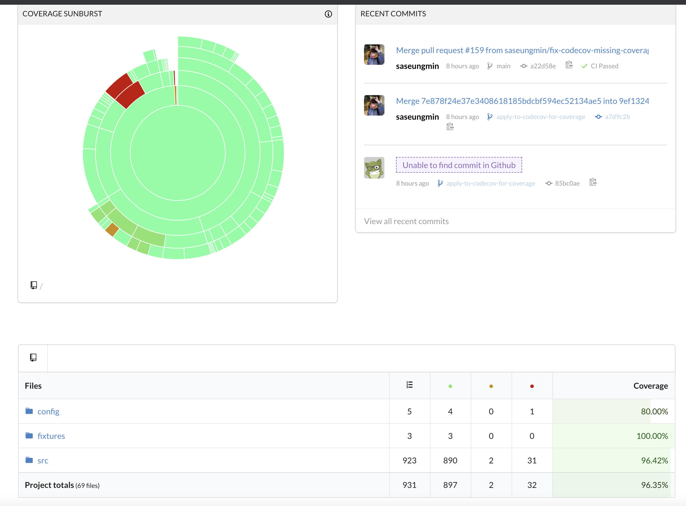

## 📆 2021-02-12(금) TIL

### 📈 어제의 계획이 예상대로 진행됐나요?
- [x] Recoil를 사용한 ToDo 앱 만들기  진행하기 (todo item에 대한 css)
  - code coverage를 위해 Codecov를 사용하였고, CI에 적용하였다. ([PR Link](https://github.com/saseungmin/Recoil_ToDo/pull/24))
- [x] 개인 프로젝트 진행하기
  - code coverage를 위해 Codecov를 사용하였고, CI에 적용하였다. ([PR Link](https://github.com/CodeSoom/ConStu/pull/158))

### 🦄 이번주 목표 진행사항은요? (오늘 조금이라도 진행했으면 체크)
- [ ] 알고리즘 공부 시작하기
- [x] 리플레쉬 및 정리
- [ ] 긍정적이게 생각하기 😤
- [x] 설날

### 🤔 공부하면서 배운것이 있다면?
- 두 프로젝트에 Codecov를 적용하여 code coverage를 나타내는 걸 배웠다.
- 저번에도 하고 싶었지만 제대로 안되서 포기했었는데, 이번에 그래도 하나를 배웠다.
- 하는 방법은 정말 간단했다.
- `.github/workflows/`에 원하는 이름의 파일로 아래와 같이 만들어준다.

```yml
name: Codecov

on: [push]

jobs:
  test:
    runs-on: ubuntu-latest
    steps:
    - uses: actions/checkout@v2 # Check out your repository
    - run: npm i # Install dependencies
    - run: npm run coverage # Run test
    - run: bash <(curl -s https://codecov.io/bash) # => 여기가 핵심
```

- `coverage`를 실행해주고 `bash <(curl -s https://codecov.io/bash)`이것만 넣어주면 된다. 이 부분은 모든 프로젝트가 다 똑같다.
- 그리고 이전에 추가로 해야할 점 하나가 있는데 해당 프로젝트에 설정에 `secrets` 부분에 Codecov 토큰을 넣어주어야 한다.

```
CODECOV_TOKEN = '토큰 입력'
```

- 이렇게 해주면 뱃지도 readme에 설정해줄 수도 있다.
- 뱃지를 클릭하면 해당 프로젝트의 coverage 그래프와 형식으로 볼 수도 있고 각 부분마다 자세하게 볼 수도 있다.



- 그리고 `npm run coverage`를 할 때 `exit code 1` 에러가 나와서 ci를 했을 때 안되는 현상이 있는데 이 부분은 `jest.config.js`의 `coverageThreshold`를 `100%`가 아니면 에러를 발생하게 해놔서 그랬던 것이였다..

```js
// jest.config.js
module.exports = {
  // 생략..
  coverageThreshold: {
    global: {
      branches: 100,
      functions: 100,
      lines: 100,
      statements: 100,
    },
  },
  // 생략..
};
```

### ⚡ 아쉬운 점 및 회고
- 오늘은 공부를 거의 안했고 그냥 쉬었다. 오늘처럼 많이 쉰날도 없었다. 하지만 마음 편하게 쉬고 싶었지만 그렇지 못하는게 문제다. 어쨌든 많이 쉬었다.
- 오늘은 일찍 좀 자서 일찍 일어나야겠다. 잠만 점점 느는거 같다. 역시 일정한 계획이 없고 할게 없으니 자꾸 이러는 거 같다. 매우 좋지 않은 습관이다.
- 오늘 원래 recoil css를 끝낼려했는데 아무것도 못했다. 내일하자.
- 그래도 해보고 싶었던 codecov를 설정해서 기분은 좋다.
- 내일은 카페 좀 가볼까..
- 일단 일찍 좀 일어나자.

### 🚀 내일 할 일
- Recoil를 사용한 ToDo 앱 만들기 진행하기 (todo item에 대한 css)
- 개인 프로젝트 진행하기

### 🎯 이번주 목표
- 알고리즘 공부 시작하기
- 리플레쉬 및 정리
- 긍정적이게 생각하기 😤
- 설날