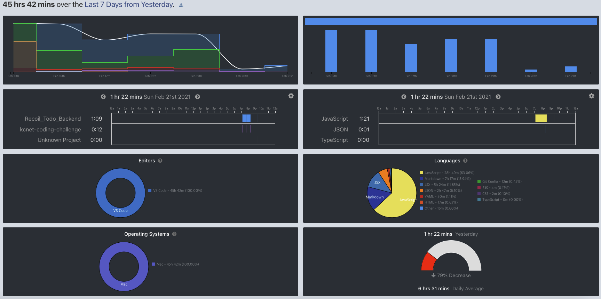

## 📆 2021-02-22(월) TIL

### 📈 오늘의 TIL
- Recoil를 사용한 ToDo 앱 만들기 진행하기 (백앤드 api 만들기)
  - Todo 작성에 대한 api를 구현했다. ([PR Link](https://github.com/saseungmin/Recoil_Todo_Backend/pull/11))
  - 로그인 검증 middleware를 만들었다. ([PR Link](https://github.com/saseungmin/Recoil_Todo_Backend/pull/11))
  - Todo 리스트를 불러오는 api를 구현했다. ([PR Link](https://github.com/saseungmin/Recoil_Todo_Backend/pull/13))
- 엘레강트 오브젝트 책 Chapter 3 읽기
  - 반을 읽고 정리했다. ([PR Link](https://github.com/saseungmin/reading_books_record_repository/pull/36))

### 🤔 공부하면서 배운것이 있다면?

#### 🎈 Recoil를 사용한 ToDo 앱 만들기(백앤드)
- `mongoose` `find`를 사용하는 방법을 다시 알게되었다.
```js
export const list = async (ctx) => {
  const { user } = ctx.state;

  try {
    const todos = await Todo.find() // Todo에서 찾는다.
      .where('writer._id') // 조건 writer._id가
      .equals(user._id) // 현재 session user _id와 같은 것들만
      .sort({ createdAt: -1 }) // 작성한 날짜 역순으로 (1일 떄는 내림차순)
      .lean() // JSON 객체로 사용하려면 필요
      .exec(); // promise 객체로 사용할려면 exec()를 붙여준다. 하지만  4이후에는 필수가 아니다.

    ctx.body = todos;
  } catch (error) {
    ctx.throw(500, error);
  }
};
```

- 위와 같이 로그인 후 `session`을 사용하는 api들이 있었다. 이 떄 테스트할 떄도 마찬가지로 로그인한 user의 `session`이 필요하다. 이 때 다음과 같이 해줄수가 있었다.

```js
describe('app', () => {
  // 생략 ...
  const setSessionCookie = async (payload) => {
    const response = await request(app.callback())
      .post('/api/auth/login')  // 로그인을 해준다.
      .send(payload);

    return response.header['set-cookie'][0] // response.header에서 쿠키 값을 가져온다.
      .split(',') // , 기준으로 배열에 담는다.
      .map((cookie) => cookie.split(';')[0]); // 마지막의 세미콜론을 자른다.
  };
});
```
- 다음은 쿠키에 담긴 session정보를 로그아웃시 삭제하는 logout api이다.

```js
describe('POST /api/auth/logout', () => {
  let sessionCookie;

  const payload = {
    id: 'seugmin',
    password: 'test123',
  };

  // beforeEach에 setSessionCookie를 호출하여 cookie 정보(배열)를 담는다.
  beforeEach(async () => {
    sessionCookie = await setSessionCookie(payload);
  });

  it('When logout success, delete cookie Response 204', async () => {
    const { status } = await request(app.callback())
      .post('/api/auth/logout')
      // 쿠키를 set해준다.
      .set('Cookie', sessionCookie);

    expect(status).toBe(204);
  });
});
```

#### 🎈엘레강트 오브젝트 Chapter 3.1, 3.2, 3.3
- [정리 내용 참고](https://github.com/saseungmin/reading_books_record_repository/tree/master/%EC%97%98%EB%A0%88%EA%B0%95%ED%8A%B8%20%EC%98%A4%EB%B8%8C%EC%A0%9D%ED%8A%B8/Chapter%203)


### ⚡ 아쉬운 점 및 회고
- 주말에 친구들과 1박 2일 여행을 갔다왔었다. 그래서 TIL를 이틀을 작성하지 못했다. 아쉽긴 하지만 어쩔 수 없었다. 다시 TIL를 시작하자!
- 주말에 쉬어서 이번주 공부량은 저번주보다 적었다. 하지만 만족한다. 



- Recoil_Todo를 얼른 빨리 마무리지어야겠다. 시간을 많이 잡아먹는거 같다. 그래도 마무리는 짓고 싶다.
- 엘레강트 오브젝트 책을 읽었는데 나한테는 너무 어려운 책인 거 같다. 객체지향 책이 세번째인데 아직도 어렵다. 어려워.. 책이 얇아서 만만하게 봤는데 생각보다 많이 어렵다. 그래도 꾸역꾸역 읽고 있기는 하다.. 아직 객체지향에 대한 이해도가 부족한 거 같다.. 실제로 써봐야지 몸으로 깨달을텐데..
- 이제 슬슬 이력서도 작성하면서 취업에 진짜 뛰어들어야 한다. 여태까지는 공부만했고, 알아보지도 않았다.
- 시간분배를 잘하자.
- 화이팅하자.

### 🚀 내일 할 일
- 알고리즘 공부
- 앨래강트 오브젝트 Chapter 3 마무리
- Recoil를 사용한 ToDo 앱 만들기 진행하기 (BackEnd)

### 🎯 이번주 목표
- 알고리즘 공부
- 앨래강트 오브젝트
- Recoil를 사용한 ToDo 앱 만들기 진행하기 (BackEnd 마무리)
- 개인 프로젝트(스터디 후기)