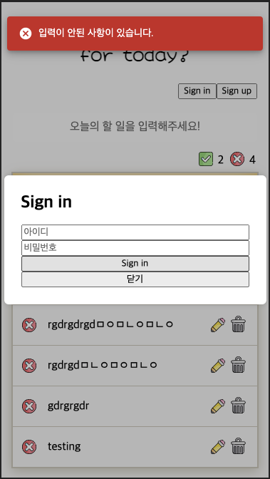

## 📆 2021-02-27(토) TIL

### 📈 어제의 계획이 예상대로 진행됐나요?
- [ ] 알고리즘 공부
- [x] Recoil를 사용한 ToDo 앱 만들기 진행하기 (회원 인증 페이지 구현)
  - 에러 핸들러 처리를 했다. 이 때 사용한 외부 디펜던시가 있는데 `notistack`를 사용했다.
  - [PR Link](https://github.com/saseungmin/Recoil_ToDo/pull/41)
- [ ] 오브젝트 책 Chapter 1 읽기

### 🦄 이번주 목표 진행사항은요? (오늘 조금이라도 진행했으면 체크)
- [ ] 알고리즘 공부
- [x] ~~앨래강트 오브젝트~~
- [x] Recoil를 사용한 ToDo 앱 만들기 진행하기
- [ ] 개인 프로젝트(스터디 후기)

### 🤔 공부하면서 배운것이 있다면?

#### 🎈 Recoil를 사용한 ToDo 앱 만들기 진행하기
- 에러 처리할 때 알림창?을 나타내고 싶어서 찾아봤는데 매우 간단하고 ui가 이뻐서 `notistack`를 선택하게 되었다.



- 일단 `notistack` 설치

```bash
> npm install -S notistack
```

- 그리고 전역에 `SnackbarProvider`를 사용하여 주입해준다. 여기서 `option` `props`값 때문에 코드질이 떨어지는 거 같이 느껴진다..
- 전역으로 설정할 수도 있고 각각 개인마다 설정해줄 수도 있다.

```jsx
import React from 'react';

import ReactDOM from 'react-dom';

import { RecoilRoot } from 'recoil';

import { SnackbarProvider } from 'notistack';

import App from './App';

ReactDOM.render(
  (
    <RecoilRoot>
      <SnackbarProvider
        maxSnack={3} // 최대 3개까지 Snackbar가 나타난다.
        preventDuplicate // 같은 값 즉, 중복된 Snackbar가 나타나면 한 번만 나타난다.
        anchorOrigin={{ // 위치 지정
          vertical: 'top', // 상단
          horizontal: 'left', // 왼쪽
        }}
      >
        <App />
      </SnackbarProvider>
    </RecoilRoot>
  ),
  document.getElementById('app'),
);
```

- `hook`으로도 사용할 수 있게 되있다. 필요한 곳에 가져다 쓰기만하면 된다.
- 첫 번째 인자에는 원하는 메시지값을 넣어준다. 두번째 인자에는 옵션이다. (`variant: error` 면 error 옵션)

```jsx
import React from 'react';

import { useRecoilValue, useResetRecoilState } from 'recoil';

import { useSnackbar } from 'notistack';

import { isCheckValidate } from '../../utils/utils';
import { EMPTY_AUTH_INPUT } from '../../utils/constants/constants';

import { authWithFields } from '../../recoil/auth';

// 생략..

const AuthModalForm = () => {
  const { enqueueSnackbar } = useSnackbar();

  const authFieldsState = useRecoilValue(authWithFields);

  const handleSubmit = (e) => {
    e.preventDefault();

    if (!isCheckValidate(authFieldsState)) {
      enqueueSnackbar(EMPTY_AUTH_INPUT, {
        variant: 'error',
      });
    }
  };

  return (
    <AuthModalFormWrapper visible={visible}>
      <AuthModalBoxWrapper>
        <h2>{formType}</h2>
        <AuthFormWrapper onSubmit={handleSubmit}>
        {/* 생략.. */}
        </AuthFormWrapper>
      </AuthModalBoxWrapper>
    </AuthModalFormWrapper>
  );
};

export default AuthModalForm;
```

### ⚡ 아쉬운 점 및 회고
- 오늘 약속이 있어 공부를 얼마 못했다. 예상대로 아니 더 많이 못했다.
- 어제 세운 계획은 역시 말도 안되는 것이였다.
- 생각하고 내가 할 수 있는 양보다 30%정도 많게 계획을 세우는 것을 목표로 하자.
- 30%는 뭐냐면 너무 딱 정해놓고 하면 그것도 동기부여가 안올 거 같아서 30%를 더 늘려잡는게 맞다고 생각한다.
- 그 30% 덕분에 조금이라도 더 빨리 할려고? 더 열심히 할려고 부지런해질거라 믿는다.
- 그래도 오늘은 즐거운 하루였다. 끝!
- 백수여서 날짜 개념이 없어졌다.. 그래도 시간 개념은 유지할려고 노력하고 있다. 월요일이 쉬는날인지도 몰랐다. ㅎㅎ
- 내일은 머리도 잘라보자. 평소와 같이 열심히.. 해보자.

### 🚀 내일 할 일
- 알고리즘 공부
- Recoil를 사용한 ToDo 앱 만들기 진행하기 (회원 인증 페이지 구현)
- 오브젝트 책 Chapter 1 읽기

### 🎯 이번주 목표
- 알고리즘 공부
- ~~앨래강트 오브젝트~~
- Recoil를 사용한 ToDo 앱 만들기 진행하기
- 개인 프로젝트(스터디 후기)