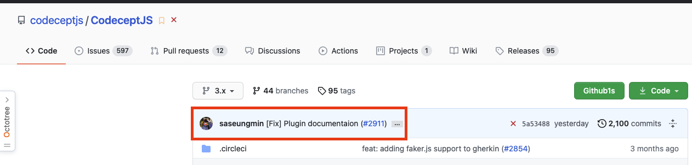
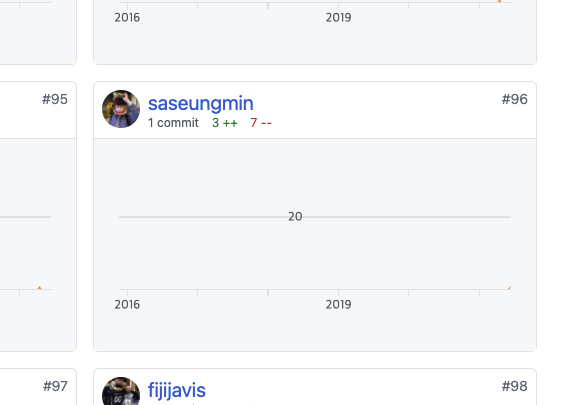

## 📆 2021-06-16(수) TIL

### 📈 오늘 한 일
- [x] 부스트캠프 지원서 작성
- [x] 쉽게 배우는 알고리즘 책의 그래프 챕터 읽고 예제를 JavaScript로 풀어보기
  - [Chapter 10: 그래프](https://github.com/saseungmin/reading_books_record_repository/tree/master/%EC%89%BD%EA%B2%8C%20%EB%B0%B0%EC%9A%B0%EB%8A%94%20%EC%95%8C%EA%B3%A0%EB%A6%AC%EC%A6%98/Chapter%2010)
- [x] Fortuna 스터디 신청자들에게 이메일 보내기
- [x] 바닐라 자바스크립트 스터디 참여

### 🦄 이번주 목표 진행사항은요? (오늘 조금이라도 진행했으면 체크)
- [x] 부스트캠프 지원서 작성
- [ ] 회사 찾아보고 지원준비
- [ ] 면접 준비
- [x] 쉽게 배우는 알고리즘 Chapter 9, 10, 11
- [x] 바닐라 자바스크립트 스터디 참여하기
- [ ] 프로그래머스 및 codewars 코테 문제들 풀기
- [x] Fortuna 스터디에 대해서 생각과 고민 앞으로 어떻게 해쳐나갈까..?

### 🤔 공부하면서 배운것이 있다면?

#### 👉 그래프
- [쉽게 배우는 알고리즘 Chapter 10: 그래프](https://github.com/saseungmin/reading_books_record_repository/tree/master/%EC%89%BD%EA%B2%8C%20%EB%B0%B0%EC%9A%B0%EB%8A%94%20%EC%95%8C%EA%B3%A0%EB%A6%AC%EC%A6%98/Chapter%2010)
- [daily coding dojo의 ISSUE에 그래프 정리](https://github.com/saseungmin/daily_coding_dojo/issues/8)

#### 👉 참고할 링크들
- [debounce 유틸 함수 만들기](https://levelup.gitconnected.com/debounce-in-javascript-improve-your-applications-performance-5b01855e086)
- [Google JavaScript Style Guide](https://google.github.io/styleguide/jsguide.html)
- [React 18: Suspense를 이용한 새로운 SSR 아키텍처](https://immigration9.github.io/react/2021/06/13/new-suspense-ssr-architecture.html?fbclid=IwAR0aZ03QvgTUL37MJLvu5DX58V5bK7gn5npfax0Lk0gjkgc0ysL1e_Xei7g)
- [input event](https://developer.mozilla.org/ko/docs/Web/API/HTMLElement/input_event)
- [유니온 파인드 알고리즘](https://goodgid.github.io/Union-Find-Algorithm/)
- [100년 살아보니 알겠다, 절대 행복할수 없는 두 부류](https://news.joins.com/article/23981265#home)

### ⚡ 아쉬운 점 및 회고
- 행복할 수 없는 두 분류... 정신적 가치를 모르는 사람과 이기주의자.. 둘다 찔리는 부분이 없지 않아 있는거 같다. 글을 읽고 반성을 하게 되었다. 나의 정신적 가치를 너무 모르는거 같은.. 그리고 공부는 진짜 꾸준히 해야한다.
- 알고리즘을 제대로 다시 책을 보며 공부하고 있다. 학교 다녔을 때 뭣도 모르고 공부할 떄보다 이해가 훨씬 잘된다. 그때는 오로지 이론으로만 공부하려고 하니까 이해하기가 힘들었는데, 지금은 코드를 알고 흐름을 아니 훨씬 더 이해하기가 수월하다. 그리고 이렇게 하나하나씩 알고리즘을 배워가니 어디다 써먹어야할지 조금씩 보인다. 이 기본적인 알고리즘들을 배워서 코테 공부에 써먹기 위해 예제들을 JavaScript로 풀어보고 있다. 확실히 해보고 안해보고는 차이가 있다. 다 아는거 같지만 알지 못하는 것처럼..
- CodeceptJS에 PR을 보낸게 merge가 되었다! 드디어 CodeceptJS에 정식으로 Contributor로 등록이 되었다! 기분이 좋다. 별거는 아니지만 오픈소스에 기여했다는 점에서!

- 요즘 TIL을 소홀히 하고 있다. 그래도 오늘은 할 일을 끝냈을때마다 TIL을 적었고, 필요한 문서들을 찾거나 봐볼만한 링크들을 찾을때마다 링크를 첨부하였다.

### 🚀 내일 할 일
- 부스트캠프 지원서 작성
- 쉽게 배우는 알고리즘 Chapter 10: 그래프에 관련된 알고리즘 풀기
- 바닐라 자바스크립트 과제

### 🎯 이번주 목표
- 부스트캠프 지원서 작성
- 회사 찾아보고 지원준비
- 면접 준비
- 쉽게 배우는 알고리즘 Chapter 9, 10, 11
- 바닐라 자바스크립트 스터디 참여하기
- 프로그래머스 및 codewars 코테 문제들 풀기
- Fortuna 스터디에 대해서 생각과 고민 앞으로 어떻게 해쳐나갈까..?
