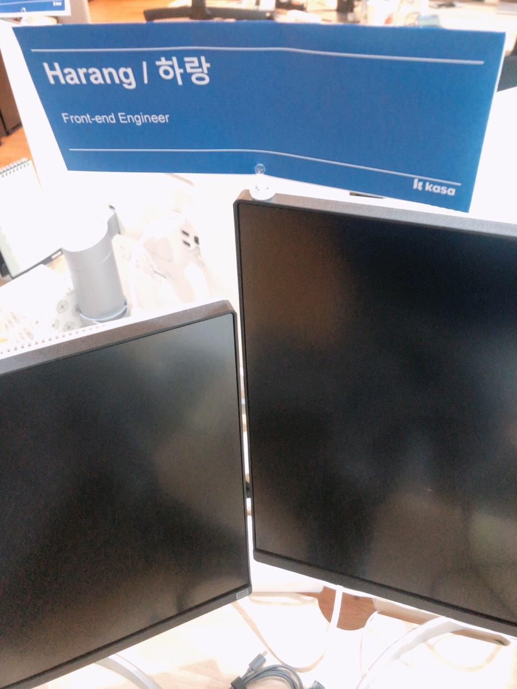

## 📆 2021-08-26(목) TIL

### 📈 오늘 한 일
- [x] 회사 문화에 적응하기
- [ ] ReScript 공식문서 훑어보기
- [x] 자취에 필요한 물품들 구매하기
- [x] 하나은행에 전화하기
- [x] 개인 프로젝트 한 피처 구현
  - [비밀번호 검증 로직 추가 PR](https://github.com/CodeSoom/ConStu/pull/229)

### 🦄 이번주 목표 진행사항은요? (오늘 조금이라도 진행했으면 체크)
- [x] 회사 문화에 적응하기
- [x] 자취에 필요한 물품들 구매하기
- [ ] 스터디 참여 및 오브젝트 8장까지 읽기
- [ ] ReScript 공식문서 훑어보기
- [x] 거주시에 처리하지 못한 일들 처리하기
- [ ] NEXT-IT Repos 관리하기

### 🤔 공부하면서 배운것이 있다면?
- [react에서 typescript로 구현 시 functional component를 만들 때 arrow function과 React.FC를 사용하는 경우가 많은데 React.FC를 사용하지 않는게 좋다](https://fettblog.eu/typescript-react-why-i-dont-use-react-fc/)

### ⚡ 아쉬운 점 및 회고
금요일이 다가올수록 피로는 누적되어 금요일날 일어나기 힘든건 절정에 달한다.. ㅠㅠ 주 5일은 누가 만든건지.. 참.. 잘 만들었네.. 사람이 최대치로 지칠때 쉬게하는 이... 머리 좋은 양반들..   

회사는 잘 적응해가고 있다! 다음주부터는 이제 할 일들이 생길텐데 그전에 준비좀 해놔야겠다. 관련해서 next.js와 ts, vue까지 좀 간단하게나마 봐놔야겠고, 가장 먼저 공부할게 뭔지 내일 가서 물어봐야겠다. 회사 분들은 정말 지나치게 좋으신 분들만 계신거 같은... 다 좋다. 다 친절하고, 서로간에 존중하는게 눈에 보인다. 나도 얼른 적응해서 함께 자라갔으면 좋겠다.   

드디어 프론트앤드 엔지니어 타이틀을.. 저 타이틀을 달려고 이 고생을.. 보람차지만.. 더 열심히하자..   

아쉬운점은 리스크립트 얼른 끝내자.. 계속 미뤄진다. 사실 우선순위가 제일 낮아서... 끝냈을 수 있을지 모르겠지만, 할 수 있는데 까지 해보자.   

얼른자자. 끝! 내일만 버티자!

### 🚀 내일 할 일
- 회사 문화에 적응하기
- ReScript 공식문서 훑어보기
- 내일 물어봐서 앞으로 사용할 기술 스택에 필요한 지식을 공부하기

### 🎯 이번주 목표
- 회사 문화에 적응하기
- 자취에 필요한 물품들 구매하기
- 스터디 참여 및 오브젝트 8장까지 읽기
- ReScript 공식문서 훑어보기
- 거주시에 처리하지 못한 일들 처리하기
- NEXT-IT Repos 관리하기
