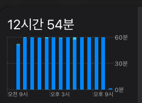

## 📆 2021-09-28(화) TIL

### 📈 어제의 계획이 예상대로 진행됐나요?
- [ ] ReScript ToDo 앱 차근차근 봐보기
- [x] 개인 프로젝트 한 피쳐씩 틈틈히
  - [Recoil_ToDo에 Cypress e2e 적용](https://github.com/saseungmin/Recoil_ToDo/pull/87)
- [x] [도저히 모르겠던 Cypress Action에 관한 질문사항을 공식 Github에 issue 날림](https://github.com/cypress-io/github-action/issues/430)

### 🦄 이번주 목표 진행사항은요? (오늘 조금이라도 진행했으면 체크)
- [ ] Object 스터디 참여 및 15장 및 부록 읽기
- [ ] 스터디를 위한 자바스크립트 코딩의 기술 10장까지 훑어보기
- [ ] ReScript ToDo 앱 차근차근 봐보기
- [ ] 블로그에 이직 후기 회고 작성
- [x] 개인 프로젝트 한피쳐씩 틈틈히
- [x] Cypress e2e 테스트 관련 공부

### 🤔 공부하면서 배운것이 있다면?

#### Cypress
- 관련된건 회사 컨플루언스에 정리
- 추후 블로그에 작성예정

#### 🎈 참고할만한 링크
- [Cypress](https://www.cypress.io/)
- [변경에 유연한 컴포넌트](https://jbee.io/web/components-should-be-flexible/)
- [Class 101 Cypress 테스트 환경 구축하기](https://class101.dev/ko/blog/2020/06/24/han/)
- [Cypress Github Integration](https://docs.cypress.io/guides/dashboard/github-integration#Install-the-Cypress-GitHub-app)
- [Cypress Github Action CI](https://docs.cypress.io/guides/continuous-integration/github-actions)

### ⚡ 아쉬운 점 및 회고
오늘 처음으로 도저히 찾다가 해결못해서 공식 github issue에 [질문](https://github.com/cypress-io/github-action/issues/430)을 날렸다. 영어는 개판이고 할 줄은 모르지만 우리에겐 파파고가.. 파파고의 도움을 받아서 질문을 올렸다. 이럴때마다 영어를 잘했으면 하는 건 항상 느낀다.   

오늘은 하루종일 정말 쉬지도 않고 했던거 같다. 아니;; 아무리생각해도 집에 있으면 나는 더 하는거 같다. 좀 같이 있어야 쉬는 타이밍도 있고, 돌아다니기도 하는데 혼자 집에서 하니까 일어나지도 않고 하루종일 일만하고 공부만해버렸다.

맥북 스크린 타임 사용시간인데.. 뭐지...? 버근가..?   

회사를 가는게 덜 일하는 이게.. 무슨.. 어쨌든 이건 고치자.. 오늘은 일찍 쉬자. 일찍 쉬는건진 모르겠지만;

### 🚀 내일 할 일
- ReScript ToDo 앱 차근차근 봐보기
- 개인 프로젝트 한 피쳐씩 틈틈히

### 🎯 이번주 목표
- Object 스터디 참여 및 15장 및 부록 읽기
- 스터디를 위한 자바스크립트 코딩의 기술 10장까지 훑어보기
- ReScript ToDo 앱 차근차근 봐보기
- 블로그에 이직 후기 회고 작성
- 개인 프로젝트 한피쳐씩 틈틈히
- Cypress e2e 테스트 관련 공부
