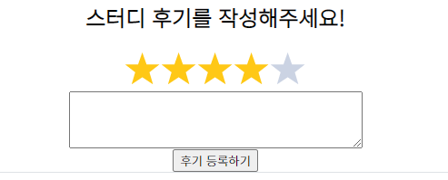

## 📆 2021-01-11 TIL

### 📈 어제의 계획이 예상대로 진행됐나요?

- [x] 객체지향의 사실과 오해 [Chapter 4 읽고 정리](https://github.com/saseungmin/reading_books_record_repository/pull/20)하기
  - 성공. 4장이 제일 어렵다고 느꼈다. 내일 다시 한번 읽어보기
- [ ] 코드숨 멤버쉽 신청하기..? (미정)
  - 이건 아직 고민중.. 어쩌지.. 아직도 모르겠다. 근데 모를땐 일단 하는게 맞는데 하고 후회하는게 맞는데..
- [x] 개인 프로젝트 진행하기 또는 Pro Git 읽기
  - 둘 중 하나인 개인 프로젝트 진행에 [후기 작성 폼](https://github.com/CodeSoom/project-react-2-saseungmin/pull/143)을 구현했다.
  - Pro Git은 차근차근 읽어보도록하자. 오늘은 못했다.
- [ ] 긍정적이게 생각하기 😤
  - 이게 제일 크게 실패..😥 쉽지 않다 쉽지 않아..


### 🤔 공부하면서 배운것이 있다면?

#### 🎈 객체지향의 사실과 오해 Chapter 4
- 이번 챕터에서는 역할, 책임, 협력에 대해서 자세히 나왔었다. 워낙 객체지향에 대한 얘기가 좀 포괄적? 이론적으로 설명이 되다보니 이해하기에 조금 부족했다.
- 내일 스터디전에 조금씩 다시 읽어봐야겠다.

> - **협력**은 한 사람이 다른 사람에게 도움을 요청할 때 시작된다. 요청을 받은 사람은 일을 처리한 후 요청한 사람에게 필요한 지식이나 서비스를 제공하는 것을 요청으로 **응답**한다.
> - 객체지향의 세계에서는 어떤 객체가 어떤 요청에 대해 대답해 줄 수 있거나, 적절한 행동을 할 의무가 있는 경우 해당 객체가 **책임**을 가진다고 말한다.
> - **한 객체가 다른 객체에게 전송한 요청은 그 요청을 수신한 객체의 책임이 수행되게 한다.** 이처럼 객체가 다른 객체에게 주어진 책임을 수행하도록 요청을 보내는 것을 **메시지 전송**(**message-send**)이라고 한다.
> - **역할**(**role**)을 사용하면 협력을 모두 포괄할 수 있는 하나의 협력으로 추상화할 수 있다.  **역할을 대체할 수 있는 객체는 동일한 메시지를 이해할 수 있는 객체로 한정된다.**
> - 역할은 객체지향 설계의 **단순성**(**simplicity**), **유연성**(**flexibility**), **재사용성**(**reusability**)을 뒷받침하는 핵심 개념이다.

- 객체지향 설계 기법의 세 가지인 **책임-주도 설계**, **디자인 패턴**, **테스트-주도 개발**에 대해서 알게 되었다.

> - **책임-주도 설계에서는 시스템의 책임을 객체의 책임으로 변환하고, 각 객체가 책임을 수행하는 중에 필요한 정보나 서비스를 제공해줄 협력자를 찾아 해당 협력자에게 책임을 할당하는 순차적인 방식으로 객체들의 협력 공동체를 구축한다.**
> - 디자인 패턴은 책임-주도 설계의 결과를 표현한다. 패턴은 모범이 되는 설계다.
> - 테스트-주도 개발의 기본 흐름은 실패하는 테스트를 작성하고, 테스트를 통과하는 가장 간단한 코드를 작성한 후, 리팩터링을 통해 중복을 제거하는 것이다.

#### 🎈 개인 프로젝트를 진행하면서 알게된 점
- 개인 프로젝트에서 스터디 후기 작성 폼을 구현했다.
- 구현하는 와중에 스터디 평을 등록하기 위해서 아래와 같이 별을 개수로 평가를 하기 위해서 npm에서 찾을 수 있었다.



- 한 5가지를 찾았는데 그 중에서 가장 다운로드 수가 많은 [react-star-ratings](https://www.npmjs.com/package/react-star-ratings)를 사용하였다. 아래와 같이 간단하게 적용할 수 있었다.

```jsx
import React, { useState } from 'react';

import StarRatings from 'react-star-ratings';

const StudyReviewForm = () => {
  const [rating, setRating] = useState(0);

  const changeRating = (newRating) => {
    setRating(newRating);
  };

  return (
    <StarRatings
      rating={rating}
      starRatedColor="#ffc816"
      numberOfStars={5}
      starDimension="40px"
      starSpacing="0"
      starHoverColor="#ffc816"
      changeRating={changeRating}
      name="rating"
    />    
  );
};

export default StudyReviewForm;
```

### ⚡ 아쉬운 점
- 흠.. 🤔 시간 낭비 하거나 그런 건 하나도 없었다.
- 퇴근 후 저녁먹고 쉬지않고 공부를 했다.
- 아쉬운 점은 하나가 있는데 긍정적이게 생각하지 못한점이다. 쉽지 않은 거 같다.
- 회사 다닌다는 건 긍정적이게 생각이 들게 하기가 힘든 환경인 거 같다. 하지만 긍정적이게 생각해야 세상이 넓게 보이기 때문에.. 긍정적인 마인드를 잃지말자.

### 🚀 내일 할 일 (퇴근 후)
- 객체지향의 사실과 오해 수요일 스터디 전 정리한 거 빠르게 다시 복습해보기
- 개인 프로젝트 진행하기 (후기 작성)
- Pro Git 읽기
- 긍정적이게 생각하기 😤