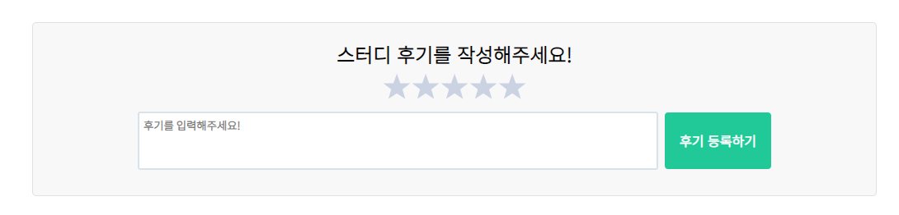

## 📆 2021-01-12 TIL

### 📈 어제의 계획이 예상대로 진행됐나요?
- [x] 객체지향의 사실과 오해 수요일 스터디 전 정리한 거 빠르게 다시 복습해보기
  - Chapter 1, 2 정리한 것을 복습했다.
- [x] 개인 프로젝트 진행하기 (후기 작성)
  - 후기 작성 폼에 대한 CSS를 수정했다.
- [ ] Pro Git 읽기
  - 읽을려했지만 오늘은 좀 일찍 쉬어야겠다.
- [x] 긍정적이게 생각하기 😤
  - 어제보단 2배? 정도 나았다. 다만 오늘은 몸이 좀 지친다.

### 🤔 공부하면서 배운것이 있다면?

#### 🎈 객체지향의 사실과 오해
- 상태란 무엇인가?

> 상태는 특정 시점에 객체가 가지고 있는 정보의 집합으로 객체의 구조적 특징을 표현한다.   
> 객체의 상태는 객체에 존재하는 정적인 **프로퍼티**와 동적인 **프로퍼티 값**으로 구성된다.   
> 객체의 프로퍼티는 **단순한 값**과 다른 객체를 참조하는 **링크**로 구분할 수 있다.   

-  행동이란 무엇인가?
> 행동이란 외부의 요쳥 또는 수신된 메시지에 **응답하기 위해 동작하고 반응**하는 활동이다.   
> 행동의 결과로 객체는 **자신의 상태를 변경**하거나 다른 객체에게 **메시지를 전달**할 수 있다.    
> 객체는 행동을 통해 다른 객체와의 협력에 참여하므로 **행동은 외부에 가시적이어야 한다.**   
> 객체가 외부에 노출하는 것은 행동뿐이며, 외부에서 객체에 접근할 수 있는 유일한 방법 역시 행동뿐이다.

- 식별자란?

> 식별자란 어떤 객체를 다른 객체와 **구분**하는 데 사용하는 **객체의 프로퍼티**다.   
> **값**은 식별자를 가지지 않기 때문에 상태를 이용한 **동등성 검사**를 통해 두 인스턴스를 비교해야 한다.   
> **객체**는 상태가 변경될 수 있기 때문에 식별자를 이용한 **동일성 검사**를 통해 두 인스턴스를 비교할 수 있다.   

- **객체의 접합성을 결정하는 것은 상태가 아니라 객체의 행동이다.**

#### 🎈 개인 프로젝트를 진행하면서 알게된 점
- 디자인은 어렵다. 역시나. 디자인 능력이 없는건 아닐까? 😢

### ⚡ 아쉬운 점
- 퇴근 후 저녁을 먹고 공부를 했지만, 오늘은 좀 일찍 쉬고 싶다.
- 어제보단 긍정적이게 생각했지만, 생각이 너무 많은거 같다. 생각을 줄이자
- 오늘 하고자했던 양을 다 못했다.
- 점심시간을 활용하고 싶은데 졸려서 맨날 잔다.

### 🚀 내일 할 일 (퇴근 후)
- 객체지향의 사실과 오해 스터디 전 정리한 거 빠르게 다시 복습해보기 (chapter 3, 4)
- 개인 프로젝트 진행하기 (후기 작성) OR Pro git 읽기
- 출퇴근길에 유튜브 보지말고 정리한 거라도 읽어보자.
- 긍정적이게 생각하기 😤