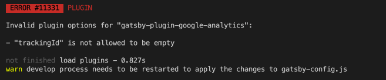

## 📆 2021-01-27(수) TIL

### 📈 어제의 계획이 예상대로 진행됐나요?
- [ ] 루비로 배우는 객체지향 디자인 스터디 참여 및 참여 전 복기
  - 스터디도 못 들었고, 복기도 못했다. 어쩔 수 없었다.
- [x] 코드숨 멤버쉽에 사용할 블로그 만들기 OR 개인 프로젝트(반응형)
  - 퇴근 후 그래도 코드숨 멤버쉽에 사용할 블로그는 만들고 배포까지 했다.
  - [배포](https://seungmin95.netlify.app/)와 간단하게 이름만 넣었다.
  - 저장소는 내 이름 저장소로 사용했다. ([Link](https://github.com/saseungmin/saseungmin))

### 🦄 이번주 목표 진행사항은요? (오늘 조금이라도 진행했으면 체크)
- [x] 윈도우 사용하지 않고 개발 및 공부하기 (Only Mac)
- [x] 코드숨 멤버쉽에 필요한 블로그 만들기
- [x] 인수인계서 작성하기 / 마무리 잘하기
- [ ] 퇴사 후 계획 가닥 잡기
- [x] 긍정적이게 생각하기 😤

### 🤔 공부하면서 배운것이 있다면?

#### 🎈 코드숨 멤버쉽에 사용할 블로그 만들기
- [gatsby-starter-bee](https://github.com/JaeYeopHan/gatsby-starter-bee)를 사용하여 만들었다. 계속 미루고 안되서 포기할려다 간단히 오늘 해결되었다.
- 아래의 파일에서 `gatsby-plugin-google-analytics`이게 자꾸 문제가 생겨서 고민했었는데 단순히 주석처리하니까 해결이 되었다. 저 플러그인은 구글 광고 플러그인인데 어짜피 사용도 안할꺼라 필요없을 듯하다.

```js
// gatsby-config.js
const metaConfig = require('./gatsby-meta-config')

module.exports = {
  siteMetadata: metaConfig,
  plugins: [
    // 생략...
    {
      resolve: `gatsby-plugin-google-analytics`,
      options: {
        trackingId: metaConfig.ga,
        head: true,
        anonymize: true,
      },
    },
    // ...
  ],
}
```

- 오류가 발생한 원인은 `gatsby-meta-config.js` 파일에서 `ga` 부분이 `''`값이라 오류가 발생하였다. 근데 다른 분들은 잘 사용하고 있을텐데.. 생각했다.

```js
// gatsby-meta-config.js
module.exports = {
  // 생략...
  ga: '', // Add your google analytics tranking ID
}
```

- 오류의 메시지는 아래와 같다.



- [netlify](https://app.netlify.com/)를 사용해서 배포를 하였다. 권장사항이였다.
- 근데 아니 이게 뭐야 이렇게 간단하다고? 너무 간단했다..

### ⚡ 아쉬운 점 및 회고
- 오늘 루비로 배우는 객체지향 디자인 스터디를 참여 못했다. 어쩔 수 없었다.. 책은 다읽었는데!!! 아쉽다.
- 다음주 스터디는 꼭 참여할 것이다.
- 오늘 그래도 코드숨 멤버쉽에 사용할 블로그를 배포까지 해놔서 기분이 좋다. 뭔가 자꾸 미루던 일 하나를 끝낸 기분이다.
- 내일은 인수인계 해야 되고, 회사 짐도 정리해야겠다. 이제 단 이틀 남았다 하하. 백수다..
- 백수인 만큼 더 열심히 달려야겠다.
- 일단 내일을 위해 얼른 자야겠다.

### 🚀 내일 할 일(퇴근 후)
- 만들기만한 코드숨에서 사용할 블로그를 사용할 수 있게 정리좀 해놔야겠다.
- 개인 프로젝트를 진행하자.(반응형 만들기)

### 🎯 이번주 목표
- 윈도우 사용하지 않고 개발 및 공부하기 (Only Mac)
- 코드숨 멤버쉽에 필요한 블로그 만들기
- 인수인계서 작성하기 / 마무리 잘하기
- 퇴사 후 계획 가닥 잡기
- 긍정적이게 생각하기 😤