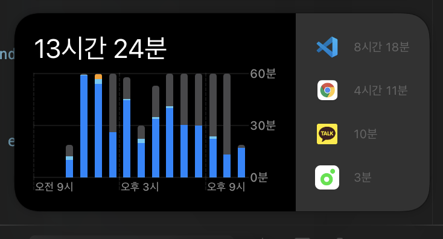
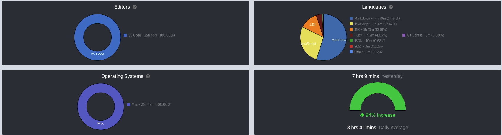

## 📆 2021-02-01(월) TIL

### 📈 어제의 계획이 예상대로 진행됐나요?
- [ ] 개인 프로젝트를 진행하자.(반응형 만들기 or 스터디 후기 보여주기)
  - 개인 프로젝트는 진행하지 못했다. 그 대신 Recoil을 사용한 ToDo 앱을 구현하기 위해서 초기 세팅을 했다.
- [x] Recoil을 사용한 ToDo 앱 만들기 ([저장소 링크](https://github.com/saseungmin/Recoil_ToDo))
  - 초기 세팅
  - CI/CI 설정과 배포 ([URL](https://saseungmin.github.io/Recoil_ToDo/))
- [x] 루비로 배우는 객체지향 디자인 Chapter 8 읽고 정리하기
  - 8장인 조합을 이용해 객체 통합하기를 읽고 정리했다. ([PR Link](https://github.com/saseungmin/reading_books_record_repository/pull/32))

### 🦄 이번주 목표 진행사항은요? (오늘 조금이라도 진행했으면 체크)
- [ ] 알고리즘 공부 계획 세우기
- [ ] 리플레쉬 및 정리
- [x] 긍정적이게 생각하기 😤

### 🤔 공부하면서 배운것이 있다면?

#### 🎈 루비로 배우는 객체지향 디자인 Chapter 8: 조합을 이용해 객체 통합하기
- 대채적인 내용은 저장소에 적혀있다. ([Link](https://github.com/saseungmin/reading_books_record_repository/tree/master/%EB%A3%A8%EB%B9%84%EB%A1%9C%20%EB%B0%B0%EC%9A%B0%EB%8A%94%20%EA%B0%9D%EC%B2%B4%EC%A7%80%ED%96%A5%20%EB%94%94%EC%9E%90%EC%9D%B8/Chapter%208))
- 상속은 코드를 배치하는 기술로 객체들의 상속 관계 속에 배치한 대가로 메시지 전달을 얻게 되었다.
- 조합을 사용하면 객체들 사이의 관계를 클래스의 상속 관계 속에 적어 놓은 필요가 없다. 객체는 각자 독립적으로 존재한다.
- 조합이 해결할 수 있는 문제라면 조합을 사용하자. 조합은 상속보다 훨씬 적은 의존성을 갖고 있다.
- 상속은 새로운 하위클래스를 만들어서 새로운 변형을 받아들이기가 매우 쉽다. 그렇기 떄문에 자연스럽게 찹조 가능하다.
- 상속은 잘못된 상속 관계 속에서 코드를 수정할 때 매우 큰 비용이 발생한다.
- 상속의 하위클래스는 상위클래스가 정의하고 있는 메서드에 의존하기 떄문에 작은 부분을 수정해도 넓은 영역에 거대한 영향을 미칠 수 있다.
- 조합된 객체는 클래스의 상속 관계에 의존하지 않고 수신한 메시지를 직접 전달한다. 또한, 작은 객체들은 하나의 책임만을 갖고 있고, 자신의 행동을 직접 명시하고 있다. 구조적으로 되어있어 추가 제거가 용이하고 대체할 수 있는 요소를 만들어준다.
- 상속은 이미 존재하는 클래스에 새로운 기능을 추가할 때 가장 잘 어울린다.
- 주어진 행도이 자신이 부분들의 총합 이상일 때 조합을 사용한다.
- 상속의 예제로 청축 키보드, 갈축 키보드, 적축 키보드는 같은 역할을 하는 키보드로 묶인다. 때문에 이것은 키보이다.
- 여러 개의 객체가 같은 역할을 수행해야 하는 상황에는 오리 타입을 사용하는데 예제로는 컴퓨터는 여러 가지 행동을 하지만 결국 컴퓨터일 뿐이다.
- 조합은 객체 자체는 부분들의 총합 이상의 것이다. 컴퓨터의 부품들은 행동과 전혀 다른, 부품마다의 고유한 행동을 가지고 있다.

#### 🎈 Recoil을 사용한 ToDo 앱 만들기
- 사실 오늘은 초기 설정만 했다. 초기 설정 즉, npm 설치, lint 설정, 웹팩 설정, 바벨.. 등등 테스트까지 설정했다.
- 또한, CI/CD를 위해서 Github actions를 사용하였다.
- 현재 진행상황은 `hello!` 메시지만 출력된다.
- github pages는 처음 사용해보았는데 정말 간단했다. 또한, CD를 위한 github workflow도 정말 잘되어 있었다.
- Recoil은 사용해본적은 없지만 사용해보고 싶었고, 간단하게 ToDo앱은 충분히 만들 수 있을 거 같아서 시도해볼려한다. TDD 사이클에 맞춰서 구현할 예정이다. Recoil에 관한 정보는 공식문서 참고할 예정
- 저장소: https://github.com/saseungmin/Recoil_ToDo
- 배포 URL: https://saseungmin.github.io/Recoil_ToDo/

### ⚡ 아쉬운 점 및 회고
- 1주일 동안 리플레쉬를 할려고 마음 먹었는데 역시 예상대로 안되는게 현실이다. 그래서 조금 다르게 접근하며 쉬어볼려한다.
- 그게 recoil을 사용한 todo 앱 만들기이다. 재밌을거 같다. 간단하게 만들 수도 있고..
- 그동안 회사다니며 정리 못한 방 정리도 해야겠다.
- 오늘은 거의 12시간동안 공부? 키보드 뚜둘기기?를 했다. 순 시간은 한 10시간 정도 된거 같다.

- 내일은 조금은 여유롭게 하고싶다.
- 그래도 오늘은 만족한다. ✌️
- 아, 마지막으로 저번주에 Mac만 사용한 image 첨부

### 🚀 내일 할 일
- 루비로 배우는 객체지향 디자인 Chapter 9 읽고 정리하기 (9장 양이 많아서 아마 반씩 나눠야할 듯 싶다.)
- Recoil를 사용한 ToDo 앱 만들기 진행하기

### 🎯 이번주 목표
- 알고리즘 공부 계획 세우기
- 리플레쉬 및 정리
- 긍정적이게 생각하기 😤