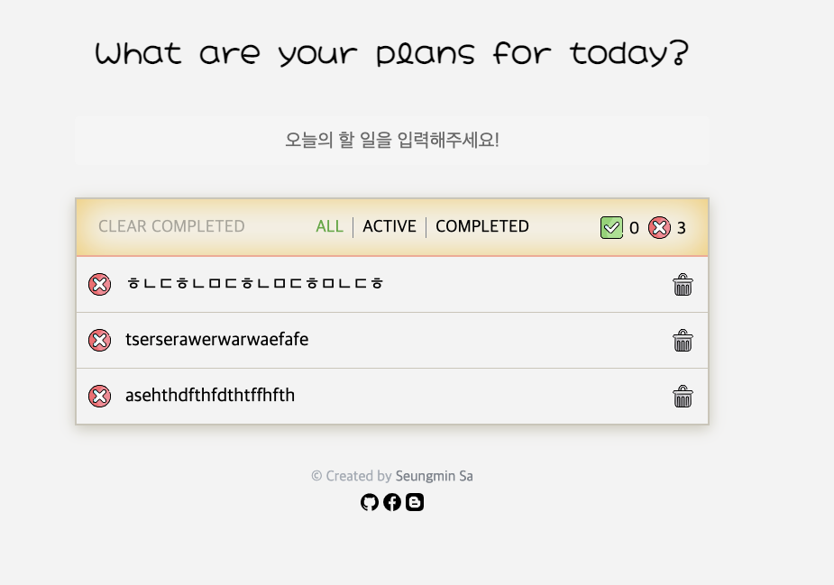
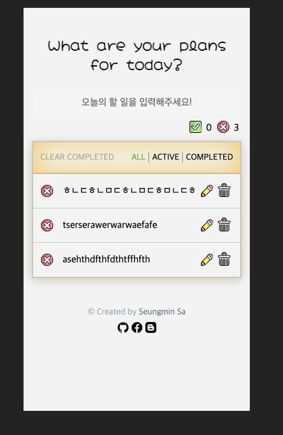

## 📆 2021-02-15(월) TIL

### 🚀 내일 할 일
- [x] 알고리즘 공부
  - 인프런 알고리즘 강의 문제 5문제를 풀었다. ([PR Link](https://github.com/saseungmin/daily_coding_dojo/pull/1))
- [x] Recoil를 사용한 ToDo 앱 만들기 진행하기 (반응형 구현)
  - 반응형 구현까지 완료하였다.

### 🦄 이번주 목표 진행사항은요? (오늘 조금이라도 진행했으면 체크)
- [x] 알고리즘 공부 시작하기
- [ ] TypeScript, 앨레강트 오브젝트, Pro Git 책 읽기
- [x] Recoil를 사용한 ToDo 앱 만들기 진행하기
- [ ] 개인 프로젝트(스터디 후기)

### 🤔 공부하면서 배운것이 있다면?

#### 🎈 알고리즘 공부를 하면서 배운것은?
- 재귀로 간단한 문제를 풀어봤는데 꼬리재귀에 대해서 이슈에 정리하였다.
- https://github.com/saseungmin/daily_coding_dojo/issues/2

#### 🎈 Recoil를 사용한 ToDo 앱 만들기
- `react-responsive`를 테스트 하는 방법을 배웠다.

```jsx
import React from 'react';

import { useMediaQuery } from 'react-responsive';

import styled from '@emotion/styled';
import { css } from '@emotion/react';

import DeleteSvg from '../../assets/icons/delete.svg';

import mq from '../../styles/responsive';
import palette from '../../styles/palette';
import Checkbox from '../../styles/Checkbox';
import EditShowTool from './EditShowTool';

const TodoItemView = ({
  item, onShowEdit, onRemove, onToggle,
}) => {

  // react-responsive: 모바일 일 때
  const isMobileScreen = useMediaQuery({ query: '(max-width: 450px)' });

  const { task, isComplete, id } = item;

  return (
    <TodoItemViewWrapper>
      {/* 생략... */}
      <TodoItemTextWrapper
        isComplete={isComplete}
        data-tip
        data-for={id}
        data-testid="todo-text"
        onDoubleClick={isMobileScreen ? undefined : onShowEdit}
      >
        {task}
      </TodoItemTextWrapper>
      <EditShowTool
        id={id}
        isMobile={isMobileScreen}
        onShowEdit={onShowEdit}
      />
      {/* 생략... */}
    </TodoItemViewWrapper>
  );
};

export default TodoItemView;
```

- 워와 같은 컴포넌트로 구성되어 있으면 다음과 같이 간단하게 모바일일 때 데스크탑일 떄에 따라 테스트가 가능하다.
- `ResponsiveContext.Provider`를 사용해서 넓이를 주입해준다.

```jsx
import React from 'react';

import { render, fireEvent } from '@testing-library/react';

import { Context as ResponsiveContext } from 'react-responsive';

import TodoItemView from './TodoItemView';

describe('TodoItemView', () => {
  const handleRemove = jest.fn();
  const handleToggle = jest.fn();
  const handleShowEdit = jest.fn();

  beforeEach(() => {
    jest.clearAllMocks();
  });

  const renderTodoItemView = ({ item, width }) => render((
    <ResponsiveContext.Provider value={{ width }}>
      <TodoItemView
        item={item}
        onRemove={handleRemove}
        onToggle={handleToggle}
        onShowEdit={handleShowEdit}
      />
    </ResponsiveContext.Provider>
  ));

  const initialState = (width) => ({
    item: {
      id: '1',
      task: 'some task',
      isComplete: false,
    },
    width,
  });

  const isDesktopState = initialState(700);
  const isMobileState = initialState(400);

  describe('renders edit input', () => {
    context('is desktop', () => {
      it('When double-clicked, the function is call.', () => {
        const { getByText } = renderTodoItemView(isDesktopState);

        fireEvent.doubleClick(getByText('some task'));

        expect(handleShowEdit).toBeCalled();
      });
    });

    context('is mobile', () => {
      it('When Click the pencil icon calls the function.', () => {
        const { getByTestId, getByText } = renderTodoItemView(isMobileState);

        fireEvent.doubleClick(getByText('some task'));

        expect(handleShowEdit).not.toBeCalled();

        fireEvent.click(getByTestId('todo-edit-icon'));

        expect(handleShowEdit).toBeCalled();
      });
    });
  });
});
```

### ⚡ 아쉬운 점 및 회고
- 오늘은 알찬 하루였다. 딱히 아쉬운 점은 없었다.
- 어제 계획했던거보다 1시간 일찍인 9시에 일어났다. 9 to 9을 실천했다.
- 하지만, 밤낮이 바뀌고 머리에 잡생각이 너무 많고 뭔가 불안한 생각에 잠을 설쳤다. 1시간 반?도 제대로 못잔거 같다. 그래서 머리가 너무 아프다..
- 어쨌든 오늘 9시에 일어난 만큼 오늘은 일찍 잘 수 있지 않을까? 노력해봐야겠다.
- Recoil을 사용한 Todo앱은 거의다 마무리가 되었다. 이제 Recoil를 사용해 비동기 통신을 해보고 싶어졌다. 그렇기 때문에 백앤드를 구현해볼 생각이다. 간단하게만 구현해보자.. 아마 세팅하는데 백앤드 TDD는 처음이라 시행착오가 있을 거 같다.
- 오늘은 일찍 잤으면 좋겠다.

- Recoil Todo desktop일 떄



- Recoil Todo mobile일 때



### 🚀 내일 할 일
- 알고리즘 공부
- Recoil를 사용한 ToDo 앱 만들기 진행하기 (백앤드 세팅)

### 🎯 이번주 목표
- 알고리즘 공부 시작하기
- TypeScript, 앨레강트 오브젝트, Pro Git 책 읽기 (다 읽는다는 뜻이 아님.)
- Recoil를 사용한 ToDo 앱 만들기 진행하기
- 개인 프로젝트(스터디 후기)