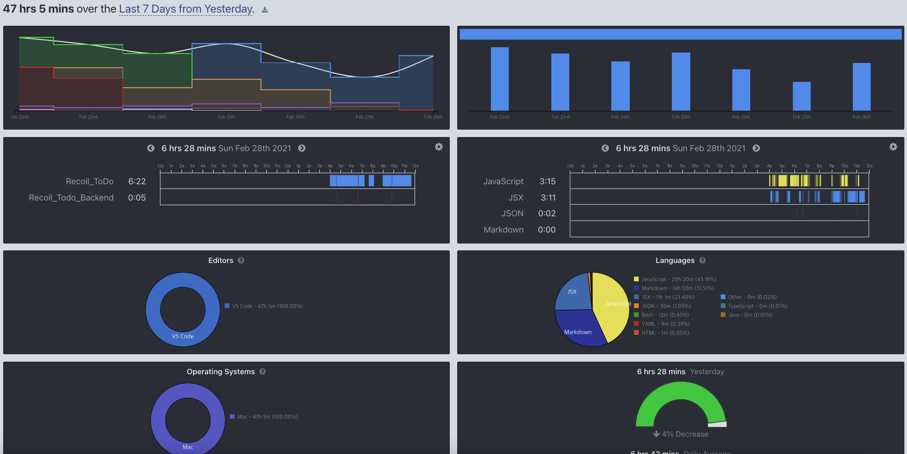

## 📆 2021-03-01(월) TIL

### 📈 어제의 계획이 예상대로 진행됐나요?
- [ ] 알고리즘 공부
- [x] Recoil를 사용한 ToDo 앱 만들기 진행하기 (회원 인증 페이지 구현)
  - 쉬지 않았지만, 드디어 회원 인증 api호출까지 구현했다.
  - [PR Link](https://github.com/saseungmin/Recoil_ToDo/pull/43)
  - 백앤드 부분의 `cors` 추가 ([PR Link](https://github.com/saseungmin/Recoil_Todo_Backend/pull/16))
- [x] 오브젝트 책 Chapter 1 읽기
  - 다 읽지는 못했다.

### 🦄 이번주 목표 진행사항은요? (오늘 조금이라도 진행했으면 체크)
- [ ] 알고리즘 공부
- [x] 오브젝트 책 Chapter 3 까지 읽기 및 스터디 참여
- [x] Recoil를 사용한 ToDo 앱 만들기 진행하기
- [ ] 긍적적 사고방식과 할 수 있는 것과 할 수 없는 것을 구분 잘하기
- [ ] 시간 분배 잘하기와 쓸대 없이 시간낭비하는 시간 아끼기

### 🤔 공부하면서 배운것이 있다면?

#### 🎈 Recoil를 사용한 ToDo 앱 만들기 진행하기
- `recoil`을 사용하여 `axios`를 사용한 비동기 통신을 위해 `selector`와 주어지는 파라미터에 따라 비동기 통신을 할 수 있는 `selectorFamily`를 활용하여 구현할 수 있다.
- 아래 예제처럼 로그인과 회원가입에 따라 비동기 통신을 `selector`의 분기를 통해 관리해줄 수 있었다.

```js
import { selector, selectorFamily } from 'recoil';

import authFieldsAtom, { authFormStatusAtom } from './atom';

import { register, login } from '../../services/api/auth';

export const authWithRegister = selectorFamily({
  key: 'authWithRegister',
  get: (user) => async () => {
    const response = await register(user);

    return response;
  },
});

export const authWithLogin = selectorFamily({
  key: 'authWithLogin',
  get: (user) => async () => {
    const response = await login(user);

    return response;
  },
});

export const branchAuthType = (user) => ({
  register: authWithRegister(user),
  login: authWithLogin(user),
});

const authWithQuery = selector({
  key: 'authWithQuery',
  get: ({ get }) => {
    const { type } = get(authFormStatusAtom);
    const user = get(authFieldsAtom);

    if (!user) {
      return null;
    }
    const response = get(branchAuthType(user)[type]);

    return response;
  },
});

export default authWithQuery;
```

- 받아온 `response` 값을 `useRecoilValueLoadable` hook을 사용하여 `Suspense`와 `ErrorBoundary` 컴포넌트를 생략해도 `loading`과 `error` 처리까지 가능하다.
- `useRecoilValueLoadable`은 세가지의 상태값을 같는다. `hasValue`와 `loading`과 `hasError`를 갖는다.

```js
const recoilLoadableStatus = {
  hasValue: ({ status, data }) => ({
    data,
    status,
    type: 'success',
  }),
  loading: () => ({
    type: 'loading',
  }),
  hasError: ({ response }) => {
    const { status, data } = response;

    return {
      data,
      status,
      type: 'error',
    };
  },
};

const recoilLoadable = ({ state, contents }) => {
  if (!state || !contents) {
    return null;
  }

  return recoilLoadableStatus[state](contents);
};

const AuthModalForm = () => {
  const [authResult, setAuthResult] = useRecoilState(authWithResult);

  // 생략..

  const authLoadable = useRecoilValueLoadable(authWithQuery);

  // 생략..

  useEffect(() => {
    const authStatus = recoilLoadable(authLoadable);

    if (authStatus && authStatus.data) {
      setAuthResult(authStatus); // 결과 값은 auth atom 상태에 담는다.
    }
  }, [authLoadable]);

  // 생략..

  return (
    // 생략..
  );
};

export default AuthModalForm;
```

- 이제 비동기 통신 이후 결과 값이 존재하면 상태에 따라 처리해줄 수 있다.

```js
const AuthModalForm = () => {
  const [authResult, setAuthResult] = useRecoilState(authWithResult);

  // 생략..

  const authLoadable = useRecoilValueLoadable(authWithQuery);

  // 생략..

  useEffect(() => {
    const authStatus = recoilLoadable(authLoadable);

    if (authStatus && authStatus.data) {
      setAuthResult(authStatus); // 결과 값은 auth atom 상태에 담는다.
    }
  }, [authLoadable]);

    useEffect(() => {
    const { auth, authError } = authResult; // atom 상태에서

    if (auth) { // auth가 존재하면 
      enqueueSnackbar(`Success ${formType}!`, { // 성공 메시지 출력
        variant: 'success',
      });
      onCloseAuthModal();
    }

    if (authError) { // authError가 존재하면
      errorSnackbar(`Failure ${formType}!`); // 에러 출력
      setResetAuthError({
        ...authResult,
        authError: null,
      });
    }
  }, [authResult]);

  return (
    // 생략..
  );
};

export default AuthModalForm;
```


### ⚡ 아쉬운 점 및 회고
- 오늘도 시간 관리를 못했다. 효율적으로 시간을 관리하려면 어떻게 해야할까.
- 구현을 하는데에 있어서 생각하며 구현하자. 무작정 구현하는게 아닌 어떻게 해야 결과가 도출이 될까라는 의문을 가지고 구현을 해야할 거 같다. 사실 이 연습이 TDD이다. 아직도 TDD 사이클을 지킨다는 건 너무 어렵다. 쉬지 않지만, 노력해야 한다.
- 책(루비로 배우는 객체지향 디자인이였었나..)에서 그런 말이 있었다. 테스트를 처음 작성하는 프로그래머가 테스트를 작성하는 데 얻은 이익보다 테스트를 작성하는 데 들이는 비용이 더 클 때, 매우 좋지 않은 상황에 놓인다. 그리고 이 생각을 가지고 테스트가 얼마나 유용한지 생각하게 되고, 굳이 테스트가 필요할까라는 생각을 갖게 된다. 그래서 테스트를 작성하는 걸 포기하는 습관을 다시 가지게 된다. 이 문제를 해결할 즉, **테스트를 작성하는 데 드는 비용을 줄이는 방법은 테스트를 포기하는 것이 아니라 테스트를 더 잘 짤 수 있도록 수련하는 것이라고..**
- 아무리 생각해도 지금 recoil ToDo 앱을 만드는 거에 TDD를 적용하며 테스트를 작성하는 건 굉장히 힘들고 현재 테스트를 작성하는데 많은 비용이 소모된다. 오늘도 테스트를 작성하는데에 있어서 꽤 많은 시간이 걸려 오늘 주어진 계획 할당량을 다 채우지 못했다. 물론 지금 우선순위를 잘 못 잡고 있는 것도 문제가 된다. 어쨌든, 요점은 책에서 나왔듯이 포기하는게 아니라 더 많은 수련을 하는 것이라고 했다. 지금 TDD의 초짜에 테스트를 작성하는 초짜 주니어 개발자이다. 해봤자 TDD를 수련한지 몇 달되지도 않았다. 당연한거다. 이 시기가 굉장히 중요하다고 생각한다. 나를 스스로 한 단계 더 발전시킬 수 있을 것이냐. 또는 여기서 나한테 져서 포기하게 될 것이냐. 둘 중 하나겠지만, 난 포기 따위 안할꺼다. 테스트를 더 잘 작성하기 위해 수련과 고통, 끈기를 가지고 노력하는 내가 되어 더 멋진 개발자로 도약하고 싶다. 테스트를 작성하는데 항상 의구심이 가득하지만, 꼭 작성하는 습관을 들이고, 포기하고 싶을 땐 책에서 나왔던 말처럼 포기하지 않고 수련을 계속 이어나가야겠다.
- 그리고 TDD 책은 꼭 조만간 읽어봐야겠다.
- 마지막으로 저번주 vscode 사용 결과?이다. vscode 사용만 47시간을 사용하였다. 저저번주랑 비교해서 큰 차이는 없다. 이제 공부시간보단 어떤 것을 공부해야 효율적이고 지금 내가 해야할 공부를 하는 것이 제일 중요하다.




### 🚀 내일 할 일
- 알고리즘 공부
- 오브젝트 책 Chapter 1,2 읽기

### 🎯 이번주 목표
- 알고리즘 공부
- 오브젝트 책 Chapter 3 까지 읽기 및 스터디 참여
- Recoil를 사용한 ToDo 앱 만들기 진행하기
- 긍적적 사고방식과 할 수 있는 것과 할 수 없는 것을 구분 잘하기
- 시간 분배 잘하기와 쓸대 없이 시간낭비하는 시간 아끼기