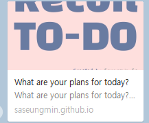

## 📆 2021-03-26(금) TIL

### 📈 어제의 계획이 예상대로 진행됐나요?
- [x] Recoil를 사용한 ToDo 앱 만들기 진행하기 (README 꾸미기)
  - README.md는 못 꾸몄지만, 그 대신 webpack 최적화를 해봤고, favicon을 만들었다.
  - [PR Link](https://github.com/saseungmin/Recoil_ToDo/pull/75)
- [x] 스터디 질문에 대해서 공부하기
  - 세 개의 질문에 대해서 공부하고 정리하였다.
  - [PR Link](https://github.com/Fortuna-Study/Frontend-Interview-Library/pull/3)
- [ ] 알고리즘 공부 (스택 부분)

### 🦄 이번주 목표 진행사항은요? (오늘 조금이라도 진행했으면 체크)
- [ ] 알고리즘 공부 (Section 6)
- ~~오브젝트 책 Chapter 11 까지 읽기 및 스터디 참여~~
- [x] Recoil를 사용한 ToDo 앱 만들기 진행하기
- [x] 취업 준비 스터디 관련 준비 및 스터디 참여

### 🤔 공부하면서 배운것이 있다면?

#### 🎈 Recoil를 사용한 ToDo 앱 만들기 진행하기
- HTML 메타 태그를 작성? 하는 법을 알게되었다.

```html
<meta name="title" content="What are your plans for today?">
<meta name="description" content="What are your plans for today?
- Todo application created using Recoil and React">
```

- 이게 뭔가 싶었는데, 아래와 같이 카카오톡에 링크 첨부하면 미리보기 식으로 나오는것이 이거때문에 나오는 거였다. 처음 알게 되었다.



- `title`이 제목 부분, `description`은 설명 같은 것이였다. 근데 이게 아래처럼 각 형식?마다 다르게 지정해줘야 한다.

```html
<!-- Open Graph / Facebook -->
<meta property="og:type" content="website" />
<meta property="og:url" content="https://saseungmin.github.io/Recoil_ToDo/"/> 
<meta property="og:title" content="What are your plans for today?">
<meta property="og:description" content="What are your plans for today?
- Todo application created using Recoil and React">
<meta property="og:image" content="./assets/logo.png" />

<!-- Twitter -->
<meta property="twitter:card" content="summary_large_image">
<meta property="twitter:url" content="https://saseungmin.github.io/Recoil_ToDo/">
<meta property="twitter:title" content="What are your plans for today?">
<meta property="twitter:description" content="What are your plans for today?
- Todo application created using Recoil and React">
<meta property="twitter:image" content="./assets/logo.png">
```

- 위와 같은 meta 태그를 설정해주는 [사이트](https://metatags.io/)도 존재했다.
- 웹팩 최적화 설정도 좀 알게 되었다.
- `MiniCssExtractPlugin`은 CSS를 별도의 파일로 추출한다. CSS가 포함된 JS 파일별로 CSS 파일을 생성한다. 사실 CSS 파일이 하나뿐이라 의미가 없긴했지만, 그래도 앞으로 사용해야 할 것이기 때문에 사용해봤다.
- `MiniCssExtractPlugin`를 사용하려면 자체적으로 제공하는 로더를 사용하는 것이 더 좋다.

```js
const MiniCssExtractPlugin = require('mini-css-extract-plugin');

module.exports = {
  module: {
    rules: [
      {
        test: /\.css$/,
        use: [
          mode === PRODUCTION
            ? MiniCssExtractPlugin.loader // 
            : 'style-loader', 'css-loader',
        ],
      },
    ],
  },
  plugins: [
    ...(mode === PRODUCTION
      ? [new MiniCssExtractPlugin({ filename: 'static/css/[name].[contenthash:8].css' })]
      : []),
  ],
};
```

- `BannerPlugin` 플러그인은 빌드 후 빌드의 정보나 커밋 버정등을 주석으로 추가시킬 수 있다. 웹팩에서 기본적으로 제공한다.
- 이때 `childProcess`를 사용하면 빌드 중에 터미널 명령어를 사용하여 커밋정보를 작성할 수 있다.
- 근데 `git config user.name`과 같은 정보로 작성할 때 에러가 발생하게 되었다. 이유는 이 프로젝트에서 CI/CD를 사용하고 있어서 당연히 정보가 없는 것이였다.
- 사실 이것도 CI/CD를 사용하면 필요 없을 거 같다.

```js
const webpack = require('webpack');
const childProcess = require('child_process');

module.exports = {
  plugins:[
    new webpack.BannerPlugin({
      banner: `
        Build Date: ${new Date().toLocaleString()} 
        Commit Version: ${childProcess.execSync('git rev-parse --short HEAD')}
        Author: seungmin sa
        Author-Email: dbd02169@naver.com
      `,
    }),
  ]
}
```

- `HtmlTemplatePlugin`을 이용해서 `favicon` 파일을 같이 빌드 시킬 수 있다. `HtmlTemplatePlugin`은 HTML 파일을 후처리하는데 사용한다.
- 또한, `minify` 옵션에 `collapseWhitespace`와 `removeComments`를 사용하면 빈칸과 주석을 제거할 수 있다.

```js
const HtmlWebpackPlugin = require('html-webpack-plugin');

const favicon = path.resolve(__dirname, 'public', 'favicon.ico');

module.exports = {
  plugins:[
    new HtmlWebpackPlugin({
      template: appHtml,
      templateParameters: {
        env: mode === DEVELOPMENT ? '(개발용)' : '',
      },
      minify: mode === PRODUCTION ? {
        collapseWhitespace: true, // 빈칸 제거
        removeComments: true, // 주석 제거
      } : false,
      favicon, // favicon 파일 설정
    }),
  ]
}
```

- 빌드 과정을 커스터마이징할 수 있는 여지를 제공하는데 그것이 `optimazation` 속성이다.
- css 파일도 빈칸을 없애는 압축을 하려면 `optimize-css-assets-webpack-plugin`을 사용한다.

```js
// webpack.config.js
const OptimizeCssAssetsPlugin = require("optimize-css-assets-webpack-plugin");
...
module.exports = {
  optimization: {
    minimizer: mode === PRODUCTION ? [
      new OptimizeCssAssetsPlugin(),
    ] : [],
  },
}
```

- `TerserWebpackPlugin`은 자바스크립트 코드를 난독화하고 `debugger` 구문을 제거한다. 또한, 콘솔 로그를 제거해주는 옵션도 있다.

```js
const TerserPlugin = require("terser-webpack-plugin");

module.exports = {
  optimization: {
    minimizer: mode === PRODUCTION ? [
      new TerserPlugin({
        terserOptions: {
          compress: {
            drop_console: true, // 콘솔로그 제거
          },
        },
      }),
    ] : [],
  },
};
```
- `externals`는 애초에 번들하지 말아야할 대상을 빌드 범위에서 빼버리는 방법이다. 이때 `axios`는 서드파티 라이브러리이기 때문에 패키지로 제공될 때 이미 빌드 과정을 거쳤기 때문에 빌드 프로세스에서 제외하는 것이 좋다.
- `externals`에 추가하면 웹팩은 코드에서 `axios`를 사용하더라도 번들에 포함하지 않고 빌드한다.

```js
module.exports = {
  externals: {
    axios: 'axios',
  },
};
```

- `axios`는 이미 `node_modules`에 위치해 있기 때문에 이를 웹팩 아웃풋 폴더에 옮기고 `index.html`에서 로딩해야한다. 그렇기 때문에 파일을 복사해주는 `CopyWebpackPlugin`를 사용한다.

```js
const CopyPlugin = require('copy-webpack-plugin');
...
module.exports = {
  plugins: [
    new CopyPlugin({
      patterns: [
        {
          from: "./node_modules/axios/dist/axios.min.js", // 여기있는 파일을
          to: "./axios.min.js", //여기로 가져온다.
        },
      ],
    }),
  ],
};
```

- `index.html`에 `axios` 스크립트를 추가해준다.

```html
<script type="text/javascript" src="axios.min.js"></script>
```

### ⚡ 아쉬운 점 및 회고
- 아쉬운점 웹팩 설정에 시간을 많이 소비했다. 생각보다 오래걸렸지만, 그만큼 배운건 많은 하루였다. 얼른 TIL에서 배운것을 정리할 수 있게 블로그형식으로 서버를 배포해야겠다.
- 오늘은 조금은 쉬엄쉬엄했나? 어쨌든 나쁘지 않은 하루였다. 내일은 카페를 가봐야겠다.
- 요즘 밤낮이 바뀔때로 바껴버려서 정신을 못차린다. 시간을 어떻게 다시 돌릴 수 있을까. 일단 문제는 유튜브... 유튜브 보는 시간을 줄여야한다..
- 내일은 기술 면접 질문을 더 공부해야겠다. 그리고 음.. 알고리즘 공부도 하자.
- 아 Recoil `README.md`도 꾸미자.
- 내 파비콘과 로고이다! 만들어보았다!


### 🚀 내일 할 일
- Recoil를 사용한 ToDo 앱 만들기 진행하기 (README 꾸미기)
- 스터디 질문에 대해서 공부하기
- 알고리즘 공부 (스택 부분)

### 🎯 이번주 목표
- 알고리즘 공부 (Section 6)
- 오브젝트 책 Chapter 11 까지 읽기 및 스터디 참여
- Recoil를 사용한 ToDo 앱 만들기 진행하기
- 취업 준비 스터디 관련 준비 및 스터디 참여