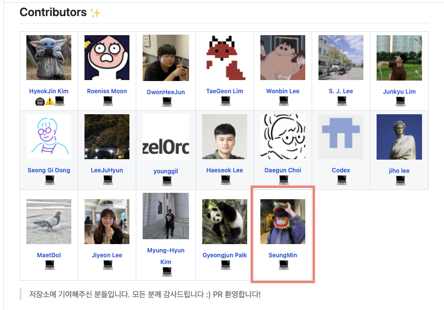

## 📆 2021-05-10(월) TIL

### 📈 어제의 계획이 예상대로 진행됐나요?
- 어제 TIL을 안썼다.
- 프로그래머스 3문제를 풀었다.
  - [파일명 정렬](https://github.com/saseungmin/daily_coding_dojo/tree/master/programmers/Level%202/%5B3%EC%B0%A8%5D%20%ED%8C%8C%EC%9D%BC%EB%AA%85%20%EC%A0%95%EB%A0%AC)
  - [디스크 컨트롤러](https://github.com/saseungmin/daily_coding_dojo/tree/master/programmers/Level%203/%EB%94%94%EC%8A%A4%ED%81%AC%20%EC%BB%A8%ED%8A%B8%EB%A1%A4%EB%9F%AC)
  - [이중우선순위큐](https://github.com/saseungmin/daily_coding_dojo/tree/master/programmers/Level%203/%EC%9D%B4%EC%A4%91%EC%9A%B0%EC%84%A0%EC%88%9C%EC%9C%84%ED%81%90)
- TS 책을 읽고 스터디를 참여했다.
  - [6장: 반복기 이해하기](https://github.com/saseungmin/typescript_programming_study/tree/master/Chapter%206)
  - [7장: Promise와 async/await 구문](https://github.com/saseungmin/typescript_programming_study/tree/master/Chapter%207)
- 별건 아니지만 오픈소스에 기여했다.
  - 정말 별거아닌 기여지만.. 이것도 뭐 기여니까 ㅎㅎ 컨트리뷰터에 등록!
  - https://github.com/brave-people/Dev-Event

### 🦄 이번주 목표 진행사항은요? (오늘 조금이라도 진행했으면 체크)
- [x] Do it TS 책 9장까지 읽고 스터디 참여
- [ ] 테스트 주도 개발로 배우는 객체 지향 설계와 실천 25장까지 읽고 스터디 참여
- [ ] 인프런 알고리즘 Section 10 풀기
- [x] 프로그래머스 코테 문제들 풀기
- [ ] 코드숨 프로젝트 Dark 모드 적용

### 🤔 공부하면서 배운것이 있다면?
- 정규표현식에 대해서 알게되었다. 또한 `localeCompare()` 메서드에 대해서 알게되었다.
- [파일명 정렬 정리내용 참고](https://github.com/saseungmin/daily_coding_dojo/tree/master/programmers/Level%202/%5B3%EC%B0%A8%5D%20%ED%8C%8C%EC%9D%BC%EB%AA%85%20%EC%A0%95%EB%A0%AC)
- 우선순위큐에 대해서 알게되었다. [디스크 컨트롤러](https://github.com/saseungmin/daily_coding_dojo/tree/master/programmers/Level%203/%EB%94%94%EC%8A%A4%ED%81%AC%20%EC%BB%A8%ED%8A%B8%EB%A1%A4%EB%9F%AC)

### ⚡ 아쉬운 점 및 회고
- TIL에 소홀히 하고 있다? 아니네 5월에 하루빼먹었구만. 나쁘지않네 만족
- 오늘 우아한테크러닝 4기 공지가 나왔다. 신청해볼꺼다. 왜냐면 작년에 들었을 때 너무 좋았기 때문.
- 근데 이번에는 우아한테크러닝 4기 공지가 메일로 오자마자 생각난게 오픈소스기여 해야겠다는 생각이 먼저들었다.
- 꽤 유명한 개발자 컨퍼런스 및 해커톤 일정을 알려주는 저장소인데 거기에 우아한테크러닝 4기를 등록했다. 저번에도 기술서적을 등록했었는데 이번에는 더 큰 star 수가 1200개나 되는 repo이다.
- 거기의 contributor에 등록이 되어있다는 것 자체가 만족스러웠다! 

- 정말 별거는 아니지만 하나하나씩 시도해가면서 나중에는 facebook이나 유명한 repo에도 기여해보고 싶다.
- 내일은 좀 더 성장한 승민이가 되자.
- 한가지 걱정거리는 요즘 불면증때문에 스트레스다. 스트레스에 더 스트레스다. 이러다 탈모오는거 아닌지..ㅠ
- 잠을 자고싶은데 잠을 못잔다. 해결방법이 없을까..
- 끝..

### 🚀 내일 할 일
- 테스트 주도 개발로 배우는 객체 지향 설계와 실천 22장까지 읽기
- 프로그래머스 코테 문제들 풀기
- 코드숨 프로젝트 Dark 모드 적용

### 🎯 이번주 목표
- Do it TS 책 9장까지 읽고 스터디 참여
- 테스트 주도 개발로 배우는 객체 지향 설계와 실천 25장까지 읽고 스터디 참여
- 인프런 알고리즘 Section 10 풀기
- 프로그래머스 코테 문제들 풀기
- 코드숨 프로젝트 Dark 모드 적용
