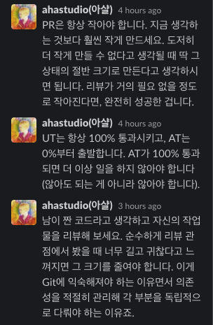
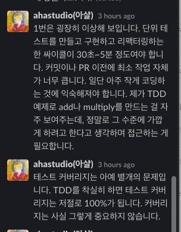

## 📆 2021-06-17(목) TIL

### 📈 오늘 한 일
- [ ] 부스트캠프 지원서 작성
- [x] 쉽게 배우는 알고리즘 책의 그래프 챕터 읽고 예제를 JavaScript로 풀어보기
  - [Chapter 10: 그래프](https://github.com/saseungmin/reading_books_record_repository/tree/master/%EC%89%BD%EA%B2%8C%20%EB%B0%B0%EC%9A%B0%EB%8A%94%20%EC%95%8C%EA%B3%A0%EB%A6%AC%EC%A6%98/Chapter%2010)
  - https://github.com/saseungmin/daily_coding_dojo/issues/8
- 프로그래머스 두 문제
  - [섬 연결하기 (프림 알고리즘과 크루스칼 알고리즘)](https://github.com/saseungmin/daily_coding_dojo/tree/master/programmers/Level%203/%EC%84%AC%20%EC%97%B0%EA%B2%B0%ED%95%98%EA%B8%B0)
  - [배달(다익스트라 알고리즘)](https://github.com/saseungmin/daily_coding_dojo/tree/master/programmers/Level%202/%EB%B0%B0%EB%8B%AC)

### 🦄 이번주 목표 진행사항은요? (오늘 조금이라도 진행했으면 체크)
- [ ] 부스트캠프 지원서 작성
- [ ] 회사 찾아보고 지원준비
- [ ] 면접 준비
- [x] 쉽게 배우는 알고리즘 Chapter 9, 10, 11
- [ ] 바닐라 자바스크립트 스터디 참여하기
- [x] 프로그래머스 및 codewars 코테 문제들 풀기
- [ ] Fortuna 스터디에 대해서 생각과 고민 앞으로 어떻게 해쳐나갈까..?

### 🤔 공부하면서 배운것이 있다면?

#### 👉 그래프
- [쉽게 배우는 알고리즘 Chapter 10: 그래프](https://github.com/saseungmin/reading_books_record_repository/tree/master/%EC%89%BD%EA%B2%8C%20%EB%B0%B0%EC%9A%B0%EB%8A%94%20%EC%95%8C%EA%B3%A0%EB%A6%AC%EC%A6%98/Chapter%2010)
- [다익스트라 알고리즘](https://github.com/saseungmin/reading_books_record_repository/blob/master/%EC%89%BD%EA%B2%8C%20%EB%B0%B0%EC%9A%B0%EB%8A%94%20%EC%95%8C%EA%B3%A0%EB%A6%AC%EC%A6%98/Chapter%2010/dijkstra.test.js)
- [daily coding dojo의 ISSUE에 그래프 정리](https://github.com/saseungmin/daily_coding_dojo/issues/8)
- [플로이드-워샬 알고리즘](https://velog.io/@adorno10/%EC%B5%9C%EB%8B%A8%EA%B2%BD%EB%A1%9C-3-%ED%94%8C%EB%A1%9C%EC%9D%B4%EB%93%9C-%EC%9B%8C%EC%85%9CFloyd-Warshall-%EC%95%8C%EA%B3%A0%EB%A6%AC%EC%A6%98)

#### 👉 참고할 링크들
- JavaScript 우선순위큐
  - https://jun-choi-4928.medium.com/javascript%EB%A1%9C-heap-priority-queue-%EA%B5%AC%ED%98%84%ED%95%98%EA%B8%B0-8bc13bf095d9
  - https://velog.io/@cada/%EC%9E%90%EB%B0%94%EC%8A%A4%ED%81%AC%EB%A6%BD%ED%8A%B8%EB%A1%9C-%EC%9A%B0%EC%84%A0%EC%88%9C%EC%9C%84-%ED%81%90-%EA%B5%AC%ED%98%84%ED%95%98%EA%B8%B0
  - https://zereight.tistory.com/735
- [코칭할 만한 사람들만 코칭하라](https://brunch.co.kr/@graypool/75)
- 아샬님의 슬랙 대화 내용중에서..

### ⚡ 아쉬운 점 및 회고
- 알고리즘 공부에 재미를 붙이고 있다. 확실한건 공부하길 잘했다는 것이다. 이런 알고리즘들을 배우지 않고 문제를 풀어봤자 결국 거기까지였다. 이론을 알고 푸니 이해도 잘되고 절대 이해못하고 포기했던 관련 문제들도 풀리기 시작했다.
- 그래프는 참 어려운거 같다. 관련 문제들을 많이 풀어봐야겠다. 이론을 배우고 이걸가지고 JavaScript로 알고리즘을 푸는 적용을 해볼려하니 시간이 자연스럽게 오래걸린다. 그만큼 배우는 것도 많아서 기분이 좋다. 더 흥미를 붙여서 해봐야겠다.
- 학교다닐떄 공부를 안해서 그만큼 남들보다 배우는 속도가 더디다.. 어떻게 따라가냐고? 몰라. 걍 하는데까지 해보는거지. 그리고 욕심을 줄일 필요성이 있다. 자기를 사랑하고, 남과 비교하지 말자.
- 충분히 잘하고 있다고 생각해야 하고 내 자신을 소중히 여길 필요가 있으며 그로인해 현재 하고 있는 공부에 대해 행복함을 느껴야한다.

### 🚀 내일 할 일
- 부스트캠프 지원서 작성
- 쉽게 배우는 알고리즘 Chapter 10: 그래프에 관련된 알고리즘 풀기
- 바닐라 자바스크립트 과제

### 🎯 이번주 목표
- 부스트캠프 지원서 작성
- 회사 찾아보고 지원준비
- 면접 준비
- 쉽게 배우는 알고리즘 Chapter 9, 10, 11
- 바닐라 자바스크립트 스터디 참여하기
- 프로그래머스 및 codewars 코테 문제들 풀기
- Fortuna 스터디에 대해서 생각과 고민 앞으로 어떻게 해쳐나갈까..?
