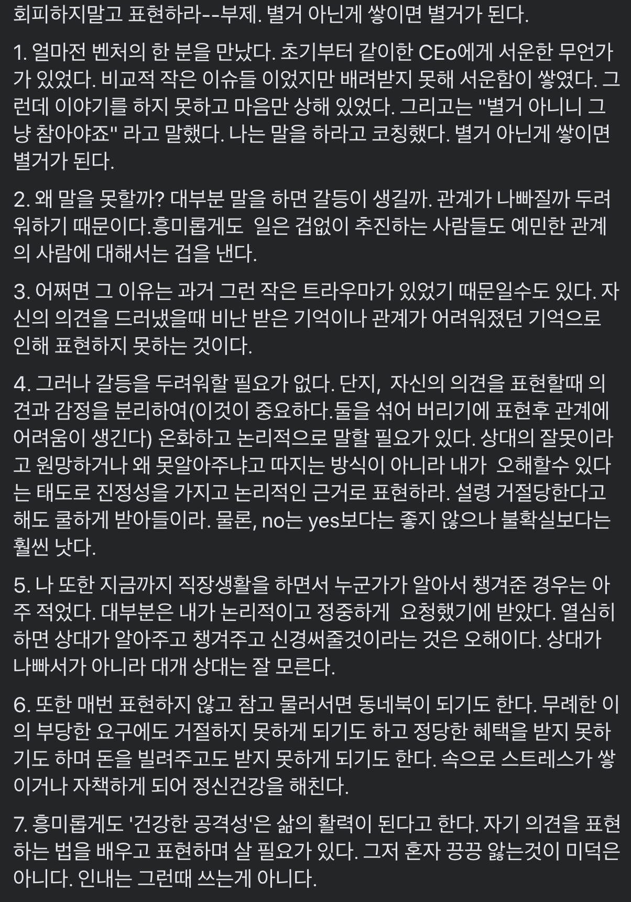

## 📆 2021-06-20(일) TIL

### 📈 오늘 한 일
- [x] 부스트캠프 지원서 작성 및 제출
- [x] 쉽게 배우는 알고리즘 책의 그래프 챕터 읽고 예제를 JavaScript로 풀어보기
  - [Chapter 10: 그래프](https://github.com/saseungmin/reading_books_record_repository/tree/master/%EC%89%BD%EA%B2%8C%20%EB%B0%B0%EC%9A%B0%EB%8A%94%20%EC%95%8C%EA%B3%A0%EB%A6%AC%EC%A6%98/Chapter%2010)
  - https://github.com/saseungmin/daily_coding_dojo/issues/8
- [ ] 바닐라 자바스크립트 과제

### 🦄 이번주 목표 진행사항은요? (오늘 조금이라도 진행했으면 체크)
- [x] 부스트캠프 지원서 작성
- [ ] 회사 찾아보고 지원준비
- [ ] 면접 준비
- [x] 쉽게 배우는 알고리즘 Chapter 9, 10, 11
- [x] 바닐라 자바스크립트 스터디 참여하기
- [ ] 프로그래머스 및 codewars 코테 문제들 풀기
- [ ] Fortuna 스터디에 대해서 생각과 고민 앞으로 어떻게 해쳐나갈까..?

### 🤔 공부하면서 배운것이 있다면?

#### 👉 참고

- [실리콘밸리 부자들은 왜 향락 대신 고통에 빠져드는가](https://news.mt.co.kr/mtview.php?no=2019032915025470686)

### ⚡ 아쉬운 점 및 회고
- 몸이 썩어가는 느낌이다. 진심 걱정해야할 떄가 온거 같다.
- 운동도 해야겠고, 병원도 가봐야할 거 같다. 관리가 절실하게 필요하다고 요즘 느껴진다. 이빨도 사랑니를 빼야할 거 같고.. 스케일링도 받아봐야할 거 같다.
- 그리고 신체적으로도 허리와 목이 자주 아프다. 또한, 손목과 팔꿈치 뒤도 자고일어나면 항상 저리다. 요즘 몸을 걱정해야할 때가 진짜 온거 같다..
- 그리고 스트레스때문에 머리도 빠지는 느낌이라 병원도 가바야할거 같다.
- 일단 가장 중요한건 일어나고 자는 시간을 좀 어떻게 바꾸던가 해야겠다. 사람은 극한으로 안좋을때 깨닫는다고.. 진짜 요즘 깨닫게된다. 그리고 주말동안에 뭐 딱히 한것도 없고 공부도 거의 안해서 회의감이 든다.
- 나는 지금 뭐하는거지..? 진짜 정신이 나간거 같다. 오늘 그래도 동기부여를 주변, 커뮤니티에서 조금 얻었다. 정신차릴 계기가 되었다. 이 회의감은 자존감을 낮게 만들 수도 있지만 스스로 이겨내야한다. 또한, 비교하지 말아야한다.
- 남들은 저기 위로 올라가는데 나는 그자리 그대로인 기분.. 정신차리자.
- 그리고 내일 스터디 첫 모임인데 어떻게 해쳐나가야할까 정말 생각이 많아진다... 잘 할수 있을까..? 자신감이 너무 부족하다..

### 🚀 내일 할 일
- 스터디 참여
- 쉽게 배우는 알고리즘 Chapter 11: 그리디
- 바닐라 자바스크립트 과제

### 🎯 이번주 목표
- 부스트캠프 지원서 작성
- 회사 찾아보고 지원준비
- 면접 준비
- 쉽게 배우는 알고리즘 Chapter 9, 10, 11
- 바닐라 자바스크립트 스터디 참여하기
- 프로그래머스 및 codewars 코테 문제들 풀기
- Fortuna 스터디에 대해서 생각과 고민 앞으로 어떻게 해쳐나갈까..?
