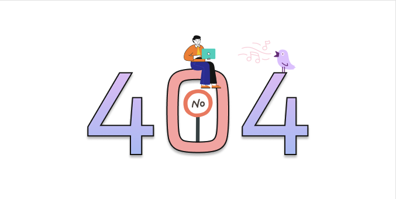

## 📆 2021-07-06(화) TIL

### 📈 오늘 한 일
- [x] Codesoom 개인 프로젝트 한 피처
  - [PR](https://github.com/CodeSoom/ConStu/pull/214)
- 기타 기술 아티클을 읽었다.
- velog-client 코드를 봤다.

### 🦄 이번주 목표 진행사항은요? (오늘 조금이라도 진행했으면 체크)
- [x] 12시 이전에 일어나기
- [ ] 기술 면접 질문 하루에 하나씩 공부
- [ ] 코테를 위한 알고리즘 공부
- ~~Fortuna 스터디 준비~~
- [ ] 회사 찾아보기
- [x] 몸관리 잘하기
- [x] 코드숨 개인 프로젝트

### 🤔 공부하면서 배운것이 있다면?
- https://github.com/velopert/velog-client
- figma 사용법

### ⚡ 아쉬운 점 및 회고
- 벌써 5시다. 점점 늦게 자고 있다.. 시간을 정해서 공부를 해야할거 같다.
- 너무 무계획적이고 정신이 없다. 또한 집중력도 떨어진다.
- 오늘 figma를 사용하여 404 페이지를 만들어보았는데 재밌었다. 하지만, 디자인은 ㄴ시간이 너무 오래걸려어어..

- 한거는 없어보이지만, 기술 아티클이나 codesoom 프로젝트에 적용하고 싶은것을 찾다보니 이것저것 찾아보았다. 재미었었지만, 너무 중구난방?이다. 그리고 아직도 어떻게 진행해야할지.. 고민중이다.
- 배고프다.
- 축구보고 얼른 자야지!
- 오늘 TIL은 간단하게!. 시간이 너무 늦어버렸어...

### 🚀 내일 할 일
- 코테를 위한 알고리즘 공부
- 기술 면접 질문 하루에 하나씩 공부
- 함께 자라기 읽기

### 🎯 이번주 목표
- 기술 면접 질문 하루에 하나씩 공부
- 코테를 위한 알고리즘 공부
- Fortuna 스터디 준비
- 회사 찾아보기
- 몸관리 잘하기
- 코드숨 개인 프로젝트
- 함께 자라기 읽기
